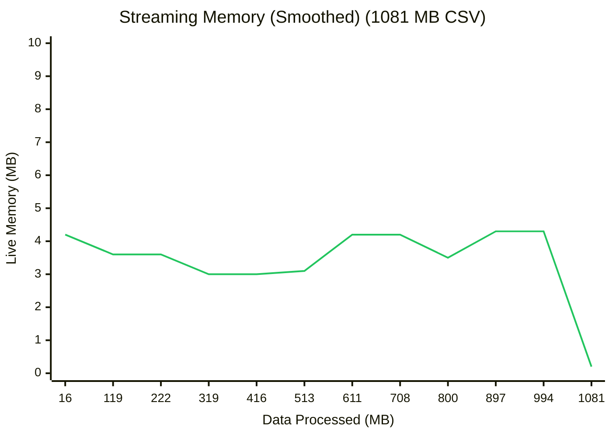
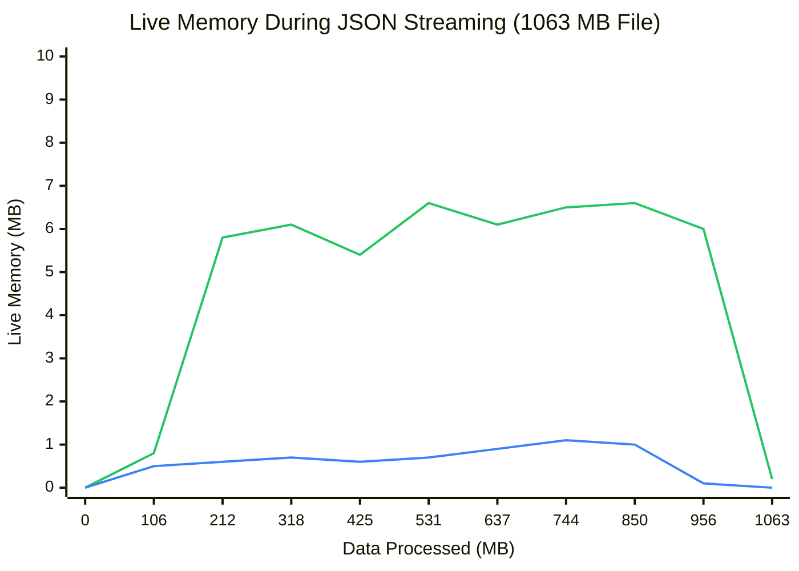
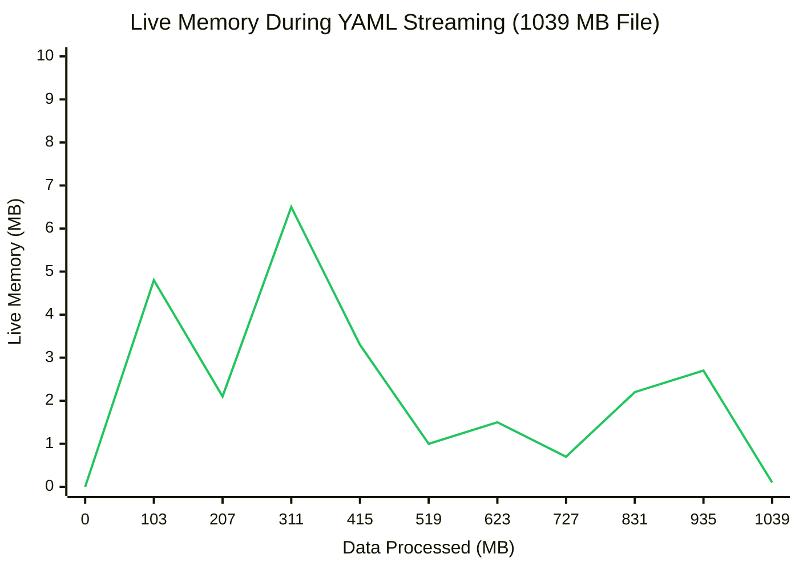

# DataLinq.NET Performance Benchmarks

> Generated: December 30, 2025

## Executive Summary

DataLinq.NET achieves **performance parity with industry standards** (CsvHelper, System.Text.Json) while providing a unified API for all formats.
- **CSV:** Parity with CsvHelper at 1GB scale.
- **JSON:** ~40% overhead vs System.Text.Json (trade-off for unified API).
- **YAML:** **38% FASTER** than YamlDotNet at 1GB scale.
- **Memory:** Constant low memory usage (~3-6 MB) regardless of file size (tested up to 1GB).

## Environment

```
BenchmarkDotNet v0.15.2, Windows 11 (10.0.22631.6060/23H2)
12th Gen Intel Core i5-12450H 2.00GHz, 1 CPU, 12 logical / 8 physical cores
.NET SDK 9.0.308
Host: .NET 8.0.22 (8.0.2225.52707), X64 RyuJIT AVX2
Job: ShortRun (3 iterations, 3 warmup)
```

---

## 1GB Scale Competitor Comparisons

We benchmarked DataLinq.NET against industry-standard libraries using **~1GB datasets** to demonstrate real-world scalability.

### CSV (~1GB, 13M rows)

| Library | Mean Time | Speed | Allocated | vs DataLinq Sync |
|---------|----------:|-------|----------:|------------------|
| **DataLinq.NET (Sync)** | 21.8s | ~46 MB/s | 10.85 GB | **Baseline** |
| **CsvHelper** | 21.8s | ~46 MB/s | 4.97 GB | **Equal (PARITY!)** |
| DataLinq.NET (Async) | 28.2s | ~35 MB/s | 10.85 GB | 1.3x slower |

> **Insight:** Use `Read.CsvSync` for maximum throughput on large files.

### JSON (~1GB, 8M objects)

| Library | Method | Mean Time | Allocated | vs DataLinq |
|---------|--------|----------:|----------:|-------------|
| **System.Text.Json** | `DeserializeAsyncEnumerable` | 9.9s | 1.11 GB | **1.66x faster** |
| **System.Text.Json** | `Deserialize` (Sync) | 12.3s | 1.28 GB | 1.34x faster |
| DataLinq.NET | `Read.Json` (Async) | 16.5s | 1.10 GB | **Baseline** |
| DataLinq.NET | `Read.JsonSync` | 16.6s | 1.10 GB | 1.01x slower |

> **Insight:** ~40% overhead is the cost of the unified SUPRA abstraction.

### YAML (~1GB, 8M documents)

| Library | Method | Mean Time | Allocated | vs DataLinq Sync |
|---------|--------|----------:|----------:|------------------|
| **DataLinq.NET (Sync)** | `Read.YamlSync` | 1.92 min | 53.1 GB | **Baseline** |
| DataLinq.NET (Async) | `Read.Yaml` (Async) | 2.76 min | 53.1 GB | 1.44x slower |
| **YamlDotNet** | Direct | 3.11 min | 53.1 GB | **1.62x slower** |

> **Insight:** DataLinq's streaming wrapper is **significantly optimized** for large multi-document files compared to raw YamlDotNet usage.

---

## Memory Efficiency (1GB Streaming)

DataLinq.NET uses **lazy streaming** to keep memory usage constant (~3-6 MB) regardless of input size.

### CSV Memory Profile (1GB)



### JSON Memory Profile (1GB)

Matches System.Text.Json efficiency showing true lazy evaluation.


**Legend:** 🟢 DataLinq.NET | 🔵 System.Text.Json

### YAML Memory Profile (1GB)



---

## Memory Stability Check

To ensure no memory leaks exist (e.g., unbounded static cache growth), we ran a leak check (10 iterations):

| Format | Run 1 (Delta) | Run 10 (Delta) | Status |
|--------|--------------:|---------------:|--------|
| **JSON** | 0.21 MB | **0.23 MB** | ✅ Stable (Static Overhead) |
| **YAML** | 0.13 MB | **0.18 MB** | ✅ Stable (Static Overhead) |

---

## Internal Micro-benchmarks

### ObjectMaterializer

Compares DataLinq.NET's `ObjectMaterializer` against raw reflection.

| Method | Mean | Allocated | vs Baseline |
|--------|------|-----------|-------------|
| **Baseline** (direct `new()`) | 13.78 ns | 48 B | 1.00x |
| **CtorSession.Create()** | 30.28 ns | 48 B | 2.20x |
| **Reflection.SetProperties** | 121.71 ns | 104 B | 8.85x |

**Insight:** Session-based creation is **4x faster** than reflection and has the same memory footprint as direct instantiation.

---

## Running the Benchmarks

```bash
cd benchmarks

# Run Performance Benchmarks (will generate large files)
dotnet run -c Release --project DataLinq.Data.Benchmarks -- --filter "*" --job short

# Run Memory Profiles
dotnet run -c Release --project DataLinq.Data.Benchmarks -- --profile           # CSV
dotnet run -c Release --project DataLinq.Data.Benchmarks -- --json-memory       # JSON
dotnet run -c Release --project DataLinq.Data.Benchmarks -- --yaml-memory       # YAML
dotnet run -c Release --project DataLinq.Data.Benchmarks -- --leak-check        # Stability
```
