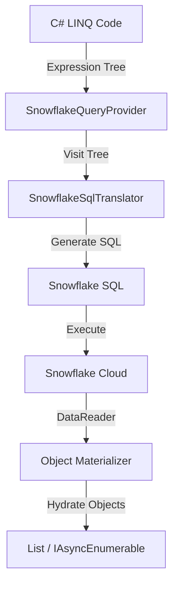

# LINQ-to-Snowflake Provider

A **C# LINQ-to-SQL translator** that enables .NET developers to write idiomatic C# code that executes natively on Snowflake Data Cloud.


## Table of Contents

1. [Overview](#overview)
2. [Architecture](#architecture)
3. [Key Features](#key-features)
4. [Usage Guide](#usage-guide)
   - [Connecting with the Context API](#connecting-with-the-context-api-recommended)
   - [Grouping and Aggregation](#grouping-and-aggregation)
   - [Joins](#joins)
5. [Advanced Features](#advanced-features)
   - [Window Functions](#window-functions-analytics)
   - [Set Operations](#set-operations)
   - [Semi-Structured Data (VARIANT)](#semi-structured-data-variant)
6. [Write Operations](#write-operations)
   - [Write Patterns](#write-patterns)
   - [Insert (Bulk Load)](#insert-bulk-load)
   - [Merge (Upsert)](#merge-upsert)
   - [Write Options](#write-options)
   - [Cases Pattern (Server-Side Routing)](#cases-pattern-server-side-routing)
   - [Transformed Writes](#transformed-writes)
7. [Best Practices](#best-practices)
8. [Comparison with SparkQuery](#comparison-with-sparkquery)
9. [See Also](#see-also)

---

## Overview

The LINQ-to-Snowflake provider bridges the gap between .NET applications and Snowflake's calculation engine. It allows developers to express complex analytical queries using standard C# LINQ syntax, which are then translated into optimized Snowflake SQL at runtime.

### Why use this?
*   ✅ **Type Safety**: Compile-time checking of your queries using C# strong typing.
*   ✅ **No Context Switching**: Write C# instead of embedding raw SQL strings.
*   ✅ **Unified API**: Same LINQ patterns as `SparkQuery` and `IEnumerable`.
*   ✅ **Server-Side Execution**: Filters, joins, and aggregations run on Snowflake, not your client.

---

## Architecture

The provider follows the standard `IQueryable` pattern:



1.  **Expression Capture**: C# captures your lambda expressions (`o => o.Amount > 100`) into an Expression Tree.
2.  **Translation**: The `SnowflakeSqlTranslator` visits this tree and generates equivalent SQL fragments (`amount > 100`).
3.  **Execution**: The final SQL is sent to Snowflake via `SnowflakeDbConnection`.
4.  **Materialization**: Results act like a forward-only stream (`IAsyncEnumerable`), reading rows and mapping them back to C# objects.

---

## Key Features

| Feature | Description | SQL Equivalent |
|---------|-------------|----------------|
| **Filtering** | `Where(x => x.Id > 1)` | `WHERE id > 1` |
| **Projections** | `Select(x => new { x.Name })` | `SELECT name` |
| **Ordering** | `OrderBy(x => x.Date)` | `ORDER BY date` |
| **Pagination** | `Take(10).Skip(5)` | `LIMIT 10 OFFSET 5` |
| **Grouping** | `GroupBy(x => x.Dept)` | `GROUP BY dept` |
| **Joins** | `Join(other, ...)` | `INNER JOIN` |
| **Aggregations** | `Sum`, `Count`, `Max`, `Min` | `SUM()`, `COUNT()`... |
| **DateTime Props** | `x.Date.Year`, `x.Date.Month` | `YEAR(date)`, `MONTH(date)` |
| **Math Functions** | `Math.Abs(x)`, `Math.Round(x)` | `ABS(x)`, `ROUND(x)` |
| **String Props** | `x.Name.Length`, `x.Name.IndexOf(s)` | `LENGTH(name)`, `POSITION(s, name)` |
| **Single Element** | `Single()`, `SingleOrDefault()` | `LIMIT 2` (verify count) |

---

## Usage Guide

### Required Namespace

```csharp
using DataLinq.SnowflakeQuery;
```

### Connecting with the Context API (Recommended)

```csharp
// Create a SnowflakeContext with required parameters
await using var context = Snowflake.Connect(
    account: "xxxxxxx.us-east-1",
    user: "my_user",
    password: "my_password",
    database: "MY_DB",
    warehouse: "MY_WAREHOUSE"
);

// Read from tables or SQL
var orders = context.Read.Table<Order>("orders");

// Raw SQL returns IAsyncEnumerable (streaming, not composable)
await foreach (var order in context.Read.Sql<Order>("SELECT * FROM orders WHERE active = true"))
{
    // Process each order
}

// Build Query
var query = orders
    .Where(o => o.Status == "Active")
    .Where(o => o.Amount > 1000)
    .OrderByDescending(o => o.Date)
    .Select(o => new { o.Id, o.CustomerName, o.Amount });

// Execute
var results = await query.ToList();
```

**Advanced Configuration:**

```csharp
await using var context = Snowflake.Connect(
    account: "xxxxxxx",
    user: "my_user",
    password: "my_password",
    database: "MY_DB",
    warehouse: "MY_WAREHOUSE",
    configure: opts => {
        opts.Schema = "PUBLIC";
        opts.Role = "ANALYST";
        opts.ConnectionTimeout = 300;  // Seconds (5 minutes)
    }
);
```


### Grouping and Aggregation

Use fluent syntax for aggregations:

```csharp
var stats = orders
    .GroupBy(o => o.Category)
    .Select(g => new 
    {
        Category = g.Key,
        Count = g.Count(),
        TotalSales = g.Sum(o => o.Amount),
        MaxSale = g.Max(o => o.Amount)
    });
```

### Joins

Combine data from multiple tables using LINQ-style joins:

```csharp
await using var context = Snowflake.Connect(account, user, password, database, warehouse);

var orders = context.Read.Table<Order>("orders");
var customers = context.Read.Table<Customer>("customers");

// Join orders with customers
var orderDetails = orders.Join(
    customers,
    o => o.CustomerId,           // Order key
    c => c.Id,                   // Customer key
    (o, c) => new {              // Result projection
        o.OrderId,
        o.Amount,
        c.Name,
        c.Email
    }
);

// Execute
var results = await orderDetails.ToList();
```

**Supported Join Types:**
- `Join(...)` - INNER JOIN (default)
- `Join(..., joinType: "LEFT")` - LEFT OUTER JOIN
- `Join(..., joinType: "RIGHT")` - RIGHT OUTER JOIN
- `Join(..., joinType: "FULL")` - FULL OUTER JOIN

---

## Advanced Features

### Window Functions (Analytics)

Perform advanced analytics (Ranking, Running Totals) without standard SQL complexity.

```csharp
// Rank orders by Amount within each Department
var ranked = orders.WithWindow(
    // 1. Define Window: PARTITION BY Dept, ORDER BY Amount DESC
    spec => spec.PartitionBy(o => o.Department).OrderByDescending(o => o.Amount),
    
    // 2. Define Projection
    (o, w) => new 
    {
        o.Id,
        o.Department,
        o.Amount,
        Rank = w.Rank(),             // RANK()
        RunningTotal = w.Sum(o.Amount) // SUM(amount) OVER (...)
    }
);
```

**Supported Functions:**
*   `Rank()`, `DenseRank()`, `RowNumber()`, `PercentRank()`, `Ntile(n)`
*   `Lag(col, n)`, `Lead(col, n)`
*   `Sum()`, `Avg()`, `Min()`, `Max()` (Over Window)

### Set Operations

Combine multiple queries efficiently.

```csharp
var q1 = orders.Where(o => o.Year == 2023);
var q2 = orders.Where(o => o.Year == 2024);

var combined = q1.Union(q2);         // UNION ALL
var distinct = q1.UnionDistinct(q2); // UNION
var overlap  = q1.Intersect(q2);     // INTERSECT
var diff     = q1.Except(q2);        // EXCEPT
```

### Semi-Structured Data (VARIANT)

Snowflake's native `VARIANT` type allows storing JSON/semi-structured data. We support the native colon syntax (`:`) for performance.

**1. Define Model using `[Variant]`**
```csharp
public class Order
{
    public int Id { get; set; }
    
    [Variant] // Marks this property as a VARIANT root
    public OrderData Data { get; set; }
    
    [Variant]
    public List<LineItem> Items { get; set; }
}

public class OrderData 
{ 
    public CustomerInfo Customer { get; set; } 
}

public class LineItem
{
    public decimal Price { get; set; }
    public int Quantity { get; set; }
}
```

**2. Query Nested Properties**
```csharp
orders.Where(o => o.Data.Customer.City == "Paris")
// Generates: WHERE data:customer:city = 'Paris'
```

**3. Filter VARIANT Arrays with `Any()`**
```csharp
orders.Where(o => o.Items.Any(i => i.Price > 100))
// Generates: WHERE ARRAY_SIZE(FILTER(items, i -> i:price > 100)) > 0
```

**Supported in `Any()` Lambda:**
- ✅ Property comparisons: `i.Price > 100`, `i.Status == "OK"`
- ✅ Logical operators: `&&`, `||`, `!`
- ✅ Arithmetic: `+`, `-`, `*`, `/`
- ✅ Method calls: `i.Name.Contains("test")`, `i.Name.StartsWith("A")` (supported since v1.2.1)

---

## Write Operations

> Write data back to Snowflake using the unified Write API.
> 
> **O(1) Memory**: All writes use native `IAsyncEnumerable` streaming. Data is batched, staged via PUT, and bulk-loaded via COPY INTO. No full materialization on the client.

### Write Patterns

DataLinq supports two write patterns with different context requirements:

| Source | Target | Context Required? | Example |
|--------|--------|-------------------|--------|
| **Query** (`SnowflakeQuery`) | Table | ❌ No (inherited) | `query.WriteTable("TABLE")` |
| **Local Data** (`IEnumerable`) | Table | ✅ Yes | `list.WriteTable(context, "TABLE")` |

**Remote-to-Remote (Pure Server-Side):**
```csharp
// Transform and route data without round-tripping to client
await context.Read.Table<Order>("ORDERS")
    .Where(o => o.Amount > 1000)
    .Select(o => new { o.Id, o.CustomerName, Total = o.Amount })
    .WriteTable("HIGH_VALUE_ORDERS");  // No context - server-side INSERT INTO...SELECT
```

**Local-to-Remote (Client Push):**
```csharp
// Push local data to Snowflake
var localRecords = new List<Order> { ... };
await localRecords.WriteTable(context, "ORDERS");  // Context required
```

### Insert (Bulk Load)

```csharp
// Simple insert
await records.WriteTable(context, "ORDERS");

// With options (chainable)
await records
    .WriteTable(context, "ORDERS")
    .CreateIfMissing()
    .Overwrite();
```

### Merge (Upsert)

```csharp
// Simple upsert on key
await records.MergeTable(context, "ORDERS", o => o.OrderId);

// Update specific columns only
await records
    .MergeTable(context, "CUSTOMERS", c => c.Email)
    .UpdateOnly("Name", "UpdatedAt");
```

### Write Options

| Method | Description |
|--------|-------------|
| `.CreateIfMissing()` | Create table if not exists |
| `.Overwrite()` | Truncate before insert |
| `.UpdateOnly(...)` | Merge: update specific columns |

### Cases Pattern (Server-Side Routing)

Route data to different destinations based on conditions—**all server-side**:

```csharp
await context.Read.Table<Order>("ORDERS")
    .Cases(
        o => o.Amount > 10000,    // Case 0: Premium
        o => o.Status == "Rush"   // Case 1: Rush
        // Default: Case 2 (Supra)
    )
    .WriteTables("PREMIUM_ORDERS", "RUSH_ORDERS", "STANDARD_ORDERS");
```

**Multi-Table Merge with Different Keys:**

```csharp
await categorizedQuery.MergeTables(
    ("PREMIUM_ORDERS", o => o.OrderId),
    ("RUSH_ORDERS", o => o.TrackingId),
    ("STANDARD_ORDERS", o => o.BatchId)
);
```

### Transformed Writes

When using `SelectCase()` to transform types, the **projected type R** is written:

```csharp
await context.Read.Table<Order>("ORDERS")
    .Cases(o => o.Amount > 10000, o => o.Status == "Rush")
    .SelectCase(
        o => new LiteOrder { Id = o.OrderId, Total = o.Amount },  // R1
        o => new LiteOrder { Id = o.OrderId, Total = o.Amount },  // R2
        o => new LiteOrder { Id = o.OrderId, Total = o.Amount }   // Supra
    )
    .WriteTables("PREMIUM_LITE", "RUSH_LITE", "STANDARD_LITE");
    // ✅ Writes LiteOrder columns, not Order columns
```

---

## Best Practices

1.  **String Comparisons**: C# is case-sensitive, SQL depends on collation. Use `.ToUpper()` or `.ToLower()` for consistent case-insensitive comparisons.
    ```csharp
    .Where(x => x.Name.ToUpper() == "JOHN")
    ```

2.  **Parameterization**: All query values are automatically parameterized using `SnowflakeDbParameter`. This prevents SQL injection attacks — you can safely use user input in LINQ expressions.

3.  **Streaming**: For large datasets, prefer `await foreach` (streaming) over `ToList()` (buffering).
    ```csharp
    await foreach (var item in query) { ... } // Memory efficient
    ```

4.  **Debugging**: Use `.Spy()` or `.Show()` to inspect intermediate results during development.
    ```csharp
    query.Where(...).Spy("AfterFilter").OrderBy(...)
    ```

5.  **Auto-UDF Decomposition — Custom Methods in Where/Select**:

     Custom methods (static, instance, lambda, or entity-parameter) in `Where()` and `Select()` are auto-translated to UDF function calls — no `Pull()` needed:
     ```csharp
     // Static method — auto-translated
     .Where(o => o.IsActive && Helpers.IsHighValue(o.Amount))
     // SQL: WHERE is_active AND auto_helpers_ishighvalue(amount)

     // Entity-parameter method — auto-decomposed
     static bool CustomValidator(Order o) => o.Amount > 1000 && o.Status == "Active";
     .Where(o => CustomValidator(o))
     // SQL: WHERE auto_class_customvalidator(amount, status)
     // Properties accessed inside the method become individual UDF parameters

     // Instance method — also supported
     var validator = new OrderValidator();
     .Where(o => validator.IsValid(o.Amount))
     // SQL: WHERE auto_ordervalidator_isvalid(amount)

     // Lambda / Func<> — also supported
     Func<decimal, bool> isPremium = x => x > 2000;
     .Where(o => isPremium(o.Amount))
     // SQL: WHERE auto_lambda_ispremium(amount)

     // Mixed expressions decompose naturally
     .Where(o => o.IsActive && IsHighValue(o.Amount))
     // SQL: WHERE is_active AND auto_helpers_ishighvalue(amount)
     // ↑ SQL part ↑ translated natively    ↑ UDF part auto-generated
     ```
     > ⚠️ **Performance**: UDFs in `Where()` prevent Snowflake predicate pushdown. The Roslyn analyzer (DFSN004) warns at build time.

6.  **Pull() — Escape Hatch (Rarely Needed)**:

    Since custom methods now auto-translate to UDFs, `Pull()` is only needed for edge cases like accessing LINQ operators not on `SnowflakeQuery<T>` (e.g., `Zip`, `Chunk`):
    ```csharp
    await foreach (var order in context.Read.Table<Order>("ORDERS")
        .Where(o => o.Amount > 100)     // ✅ Server-side (SQL WHERE)
        .Take(1000)                      // ✅ Server-side (SQL LIMIT)
        .Pull()                          // ← Switch to local (rarely needed)
        .Chunk(100))                     // Client-side batching
    {
        // Streaming row-by-row, not buffered
    }
    ```

7.  **ForEach — Server-Side and Client-Side**:

     **Server-Side (Deferred):** Use `ForEach()` to deploy server-side logic to Snowflake. Execution is deferred until materialization (`Count()`, `ToList()`, `ToArray()`):
     ```csharp
     // Static fields are auto-synced back from Snowflake after execution
     static long _count = 0;
     static double _total = 0.0;
     static void Accumulate(long id, double amount) { _count++; _total += amount; }

     var count = await context.Read.Table<Order>("ORDERS")
         .ForEach((Action<long, double>)Accumulate)   // Deferred — nothing runs yet
         .Count();                                     // Triggers execution + sync

     Console.WriteLine($"Processed {_count} rows, total: {_total}");
    ```

    **Client-Side (Pull):** For complex C# logic, use `Pull()` to switch to client-side streaming:
    ```csharp
    await query.Pull().ForEach(x => Log(x)).Do();
    ```

---

## Comparison with SparkQuery

| Feature | SnowflakeQuery | SparkQuery |
|---------|---------------|------------|
| **Execution Engine** | Snowflake SQL | Apache Spark (JVM) |
| **Window Functions** | ✅ Supported | ✅ Supported |
| **Set Operations** | ✅ Supported | ✅ Supported |
| **Nested Data** | ✅ `VARIANT` (`:`) | ✅ Struct (`.`) |
| **Caching** | ⚡ Automatic | ✅ Manual (`.Cache()`) |
| **Distribution** | ⚡ Automatic | ✅ Manual (`.Repartition()`) |

Both providers share ~95% API surface area, allowing you to reuse your LINQ skills across both Big Data platforms.

---

## See Also

- [LINQ-to-Snowflake Capabilities & Limitations](LINQ-to-Snowflake-Capabilities.md) — Detailed feature support matrix
- [LINQ-to-Spark](LINQ-to-Spark.md) — SparkQuery provider documentation
- [Cases Pattern](Cases-Pattern.md) — Cases/SelectCase pattern
