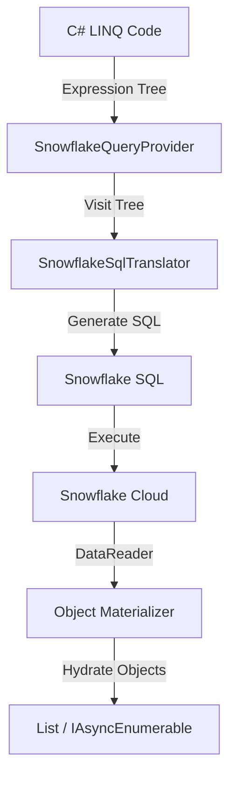

# LINQ-to-Snowflake Provider

A **C# LINQ-to-SQL translator** that enables .NET developers to write idiomatic C# code that executes natively on Snowflake Data Cloud.


## Table of Contents

1. [Overview](#overview)
2. [Architecture](#architecture)
3. [Key Features](#key-features)
4. [Usage Guide](#usage-guide)
   - [Connecting with the Context API](#connecting-with-the-context-api-recommended)
   - [Grouping and Aggregation](#grouping-and-aggregation)
   - [Joins](#joins)
5. [Advanced Features](#advanced-features)
   - [Window Functions](#window-functions-analytics)
   - [Set Operations](#set-operations)
   - [Streaming](#streaming)
   - [Server-Side Functions](#server-side-functions)
   - [ForEach](#foreach--server-side-iteration)
   - [Semi-Structured Data (VARIANT)](#semi-structured-data-variant)
6. [Write Operations](#write-operations)
   - [Write Patterns](#write-patterns)
   - [Insert (Bulk Load)](#insert-bulk-load)
   - [Merge (Upsert)](#merge-upsert)
   - [Write Options](#write-options)
   - [Cases Pattern (Server-Side Routing)](#cases-pattern-server-side-routing)
   - [ForEachCase (Per-Category Accumulation)](#foreachcase--per-category-server-side-accumulation)
   - [Transformed Writes](#transformed-writes)
7. [Database Operations](#database-operations)
8. [Best Practices](#best-practices)
9. [See Also](#see-also)

---

## Overview

The LINQ-to-Snowflake provider bridges the gap between .NET applications and Snowflake's calculation engine. It allows developers to express complex analytical queries using standard C# LINQ syntax, which are then translated into optimized Snowflake SQL at runtime.

### Why use this?
*   ✅ **Type Safety**: Compile-time checking of your queries using C# strong typing.
*   ✅ **No Context Switching**: Write C# instead of embedding raw SQL strings.
*   ✅ **Unified API**: Same LINQ patterns as `SparkQuery` and `IEnumerable`.
*   ✅ **Server-Side Execution**: Filters, joins, and aggregations run on Snowflake, not your client.

---

## Architecture

The provider follows the standard `IQueryable` pattern:



1.  **Expression Capture**: C# captures your lambda expressions (`o => o.Amount > 100`) into an Expression Tree.
2.  **Translation**: The `SnowflakeSqlTranslator` visits this tree and generates equivalent SQL fragments (`amount > 100`).
3.  **Execution**: The final SQL is sent to Snowflake via `SnowflakeDbConnection`.
4.  **Materialization**: Results act like a forward-only stream (`IAsyncEnumerable`), reading rows and mapping them back to C# objects.

---

## Key Features

| Feature | Description | SQL Equivalent |
|---------|-------------|----------------|
| **Filtering** | `Where(x => x.Id > 1)` | `WHERE id > 1` |
| **Projections** | `Select(x => new { x.Name })` | `SELECT name` |
| **Ordering** | `OrderBy(x => x.Date)` | `ORDER BY date` |
| **Pagination** | `Take(10).Skip(5)` | `LIMIT 10 OFFSET 5` (`Skip` requires `OrderBy`) |
| **Grouping** | `GroupBy(x => x.Dept)` | `GROUP BY dept` |
| **Joins** | `Join(other, ...)` | `INNER JOIN` |
| **Aggregations** | `Sum`, `Count`, `Max`, `Min` | `SUM()`, `COUNT()`... |
| **DateTime Props** | `x.Date.Year`, `x.Date.Month` | `YEAR(date)`, `MONTH(date)` |
| **Math Functions** | `Math.Abs(x)`, `Math.Round(x)` | `ABS(x)`, `ROUND(x)` |
| **String Props** | `x.Name.Length`, `x.Name.IndexOf(s)` | `LENGTH(name)`, `POSITION(s, name)` |
| **Single Element** | `Single()`, `SingleOrDefault()` | `LIMIT 2` (verify count) |
| **SelectMany** | `SelectMany(o => o.Items)` | `LATERAL FLATTEN(items)` |
| **GroupJoin** | `GroupJoin(other, ...)` | `LEFT JOIN + GROUP BY` |
| **Terminal Aggregates** | `Sum()`, `Average()`, `Min()`, `Max()` | `SELECT SUM/AVG/MIN/MAX(col)` |

---

## Usage Guide

### Required Namespace

```csharp
using DataLinq.SnowflakeQuery;
```

### Connecting with the Context API (Recommended)

DataLinq supports both standard password and RSA Key-Pair authentication.

**1. Standard Password Auth:**
```csharp
// Create a SnowflakeContext with required parameters
await using var context = Snowflake.Connect(
    account: "xy12345.us-east-1",
    user: "my_user",
    password: "my_password",
    database: "MY_DB",
    warehouse: "MY_WAREHOUSE"
);
```

**2. RSA Key-Pair Auth (Recommended for service accounts):**
```csharp
// Connect using a PKCS#8 undecrypted private key file (.pem or .p8)
await using var context = Snowflake.Connect(
    account: "xy12345.us-east-1",
    user: "svc_account",
    privateKeyFile: new FileInfo("path/to/rsa_key.p8"),
    database: "MY_DB",
    warehouse: "MY_WAREHOUSE"
);
```

**Advanced Configuration:**

```csharp
await using var context = Snowflake.Connect(
    account: "xy12345.us-east-1",
    user: "my_user",
    password: "my_password", // or use privateKey / privateKeyFile
    database: "MY_DB",
    warehouse: "MY_WAREHOUSE",
    configure: opts => {
        opts.Schema = "PUBLIC";
        opts.Role = "ANALYST";
        opts.ConnectionTimeout = 300;  // Seconds (5 minutes)
    }
);
```

### Compile-Time Sorting Enforcement

To guarantee deterministic pagination and valid SQL generation, ordering operations are enforced natively by the C# type system:

1. Calling `.OrderBy()` or `.OrderByDescending()` returns an `OrderedSnowflakeQuery<T>`.
2. Operations that heavily depend on deterministic row order—specifically `.Skip()` and `.ThenBy()`—are exclusively defined as extension methods on `OrderedSnowflakeQuery<T>`.

> [!WARNING]
> If you attempt to call `.Skip()` or `.ThenBy()` directly on an unordered `SnowflakeQuery<T>`, your C# compiler will instantly fail the build. You must explicitly chain `.OrderBy()` first.

### Grouping and Aggregation

Use fluent syntax for aggregations:

```csharp
var stats = orders
    .GroupBy(o => o.Category)
    .Select(g => new 
    {
        Category = g.Key,
        Count = g.Count(),
        TotalSales = g.Sum(o => o.Amount),
        MaxSale = g.Max(o => o.Amount)
    });
```

> **Note:** `GroupBy` supports both single-key and composite-key grouping (e.g., `GroupBy(o => new { o.Category, o.Region })`).

### Terminal Aggregates

Compute a single aggregate value directly — no `GroupBy` needed:

```csharp
// Single round-trip to Snowflake each
var total   = await orders.Sum(o => o.Amount);       // SELECT SUM(amount) FROM orders
var average = await orders.Average(o => o.Amount);   // SELECT AVG(amount) FROM orders
var max     = await orders.Max(o => o.Amount);       // SELECT MAX(amount) FROM orders
var min     = await orders.Min(o => o.Amount);       // SELECT MIN(amount) FROM orders

// Composable with Where
var activeTotal = await orders.Where(o => o.Year == 2024).Sum(o => o.Amount);
```

**Overloads:** `Sum` accepts `decimal`, `double`, `long`, `int` selectors. `Average` always returns `double`. `Min`/`Max` are generic — work with any comparable type.


### Joins

Combine data from multiple tables using LINQ-style joins:

```csharp
await using var context = Snowflake.Connect(account, user, password, database, warehouse);

var orders = context.Read.Table<Order>("orders");
var customers = context.Read.Table<Customer>("customers");

// Join orders with customers
var orderDetails = orders.Join(
    customers,
    o => o.CustomerId,           // Order key
    c => c.Id,                   // Customer key
    (o, c) => new {              // Result projection
        o.OrderId,
        o.Amount,
        c.Name,
        c.Email
    }
);

// Execute
var results = await orderDetails.ToList();
```

**Supported Join Types:**
- `Join(...)` - INNER JOIN (default)
- `Join(..., joinType: "LEFT")` - LEFT OUTER JOIN
- `Join(..., joinType: "RIGHT")` - RIGHT OUTER JOIN
- `Join(..., joinType: "FULL")` - FULL OUTER JOIN

**Composite Join Keys** — join on multiple columns simultaneously:

```csharp
var result = orders.Join(
    customers,
    o => new { o.Region, o.CustomerId },    // Composite left key
    c => new { c.Region, CustomerId = c.Id }, // Composite right key
    (o, c) => new { o.OrderId, c.Name }
);
// SQL: ... ON l.region = r.region AND l.customer_id = r.id
```

**Computed Join Keys** — join on expressions, not just raw columns:

```csharp
var result = orders.Join(
    customers,
    o => o.Name.ToUpper(),          // Computed left key
    c => c.Name.ToUpper(),          // Computed right key
    (o, c) => new { o.OrderId, c.Email }
);
// SQL: ... ON UPPER(l.name) = UPPER(r.name)
```

> **Note:** Composite and computed keys can be combined — `new { o.Name.ToUpper(), o.Region }` works.

### GroupJoin

Group elements from another query by a matching key (LEFT JOIN + GROUP BY):

```csharp
var customerOrders = customers.GroupJoin(
    orders,
    c => c.Id,                    // Customer key
    o => o.CustomerId,            // Order key
    (c, orderGroup) => new {      // Result projection
        c.Name,
        OrderCount = orderGroup.Count()
    }
);
// SQL: LEFT JOIN ... ON ... GROUP BY ...
```

---

## Advanced Features

### Window Functions (Analytics)

Perform advanced analytics (Ranking, Running Totals) without standard SQL complexity.

```csharp
// Define a DTO for the result (TResult must have a parameterless constructor)
public class RankedOrder { public string Rank { get; set; } public string RunningTotal { get; set; } }

// Rank orders by Amount within each Department
var ranked = orders.WithWindow<Order, RankedOrder>(
    // 1. Define Window: PARTITION BY Dept, ORDER BY Amount DESC
    spec => spec.PartitionBy(o => o.Department).OrderByDescending(o => o.Amount),
    
    // 2. Define Columns — returns (Alias, Sql) tuples
    (o, w) => new[]
    {
        ("Rank", w.Rank()),               // RANK() OVER (...)
        ("RunningTotal", w.Sum("Amount"))  // SUM(amount) OVER (...)
    }
);
```

**Supported Functions:**
*   `Rank()`, `DenseRank()`, `RowNumber()`, `PercentRank()`, `Ntile(n)`
*   `Lag(col, n)`, `Lead(col, n)`
*   `Sum()`, `Avg()`, `Min()`, `Max()` (Over Window)

### Set Operations

Combine multiple queries efficiently.

```csharp
var q1 = orders.Where(o => o.Year == 2023);
var q2 = orders.Where(o => o.Year == 2024);

var combined = q1.Union(q2);         // UNION ALL
var distinct = q1.UnionDistinct(q2); // UNION
var overlap  = q1.Intersect(q2);     // INTERSECT
var diff     = q1.Except(q2);        // EXCEPT
```

### Streaming — The Server/Client Boundary

`SnowflakeQuery<T>` is a **server-side query plan** — every method you chain (`.Where()`, `.Select()`, `.OrderBy()`, `.Join()`, `.GroupBy()`) stays on Snowflake. No data crosses the network until you explicitly request it.

**`.Pull()`** is the single, explicit point where data crosses from server to client. It returns an `IAsyncEnumerable<T>` — O(1) memory, row-by-row streaming:

```csharp
await foreach (var order in context.Read.Table<Order>("ORDERS")
    .Where(o => o.Amount > 100)        // Server-side (SQL WHERE)
    .Take(1000)                        // Server-side (SQL LIMIT)
    .Pull())                           // ← Explicit boundary: data starts flowing
{
    ProcessLocally(order);             // Client-side — O(1) memory
}
```

> [!WARNING]
> **`Pull()` is the ONLY way to stream data to the client.** You cannot `await foreach` directly on a `SnowflakeQuery<T>` — it will not compile. This is by design: the execution boundary between server-side SQL and client-side C# must always be explicit. Use `.ToList()`, `.ToArray()`, `.First()`, `.Count()`, or `.Pull()` to cross the boundary.

> **When to use `Pull()`**: Use `.Pull()` when you need to apply complex C# logic that can't be expressed as SQL nor as a server-side function.

### Server-Side Functions

Custom C# methods in `Where()` and `Select()` are automatically deployed as **server-side functions** on Snowflake — your C# runs directly in the warehouse:

```csharp
// Static method — auto-translated
.Where(o => o.IsActive && Helpers.IsHighValue(o.Amount))
// SQL: WHERE is_active AND auto_helpers_ishighvalue(amount)

// Entity-parameter method — auto-decomposed
static bool CustomValidator(Order o) => o.Amount > 1000 && o.Status == "Active";
.Where(o => CustomValidator(o))
// SQL: WHERE auto_class_customvalidator(amount, status)
// Properties accessed inside the method become individual function parameters

// Instance method — also supported
var validator = new OrderValidator();
.Where(o => validator.IsValid(o.Amount))
// SQL: WHERE auto_ordervalidator_isvalid(amount)

// Mixed expressions decompose naturally
.Where(o => o.IsActive && IsHighValue(o.Amount))
// SQL: WHERE is_active AND auto_helpers_ishighvalue(amount)
// ↑ native SQL                ↑ server-side function auto-generated
```

> ⚠️ **Performance & billing**: Server-side functions in `Where()` prevent Snowflake predicate pushdown. Prefer native operators when possible. The build-time analyzer (`DFSN004`) warns automatically.

### ForEach — Server-Side Iteration

Deploy server-side logic to Snowflake. Execution is deferred until a terminal action (`.Do()`, `.Count()`, `.ToList()`, `.ToArray()`):

```csharp
// Static fields are auto-synced back from Snowflake after execution
static long _count = 0;
static decimal _total = 0;

await context.Read.Table<Order>("ORDERS")
    .ForEach(o => { _count++; _total += o.Amount; })  // Deferred — nothing runs yet
    .Do();                                             // ✅ Natural terminal: execute, discard result

Console.WriteLine($"Processed {_count} rows, total: {_total}");
```

> **Lazy Contract:** `ForEach()` returns `SnowflakeQuery<T>` — it is a transformation, not an action. `.Do()` is the explicit action that forces execution. If you need the row count back, use `.Count()` instead.

**Supported accumulator types:** `int`, `long`, `double`, `float`, `decimal`, `bool`, `string`.

### Semi-Structured Data (VARIANT)

Snowflake's native `VARIANT` type stores JSON/semi-structured data. DataLinq supports full read-write lifecycle with native colon syntax (`:`) for performance.

**1. Define Model — Mark VARIANT columns with `[Variant]`**
```csharp
public class Order
{
    public int Id { get; set; }
    public string Status { get; set; }
    
    [Variant] // This property maps to a VARIANT column
    public OrderData Data { get; set; }
    
    [Variant] // Arrays of objects also supported
    public List<LineItem> Items { get; set; }
}

public class OrderData 
{ 
    public CustomerInfo Customer { get; set; } 
}

public class LineItem
{
    public decimal Price { get; set; }
    public int Quantity { get; set; }
    public bool Active { get; set; }
}
```

**2. Write — `[Variant]` properties are auto-serialized to JSON**

When writing data, `[Variant]` properties are automatically serialized to JSON (camelCase). `createIfMissing: true` creates VARIANT columns for these properties:

```csharp
var orders = new List<Order>
{
    new Order
    {
        Id = 1,
        Status = "Active",
        Data = new OrderData { Customer = new CustomerInfo { City = "Paris" } },
        Items = new List<LineItem>
        {
            new LineItem { Price = 150, Quantity = 2, Active = true },
            new LineItem { Price = 50, Quantity = 10, Active = false }
        }
    }
};

// WriteTable auto-serializes [Variant] properties to JSON
// createIfMissing creates: id INTEGER, status VARCHAR, data VARIANT, items VARIANT
await orders.WriteTable(context, "ORDERS", createIfMissing: true);
```

**3. Read — Nested property access via colon syntax**
```csharp
// Access nested VARIANT properties — translates to Snowflake colon syntax
orders.Where(o => o.Data.Customer.City == "Paris")
// SQL: WHERE data:customer:city = 'Paris'

orders.Select(o => new { o.Id, City = o.Data.Customer.City })
// SQL: SELECT id, data:customer:city AS city
```

**4. VARIANT Array Operations — Higher-Order Functions**

DataLinq translates C# LINQ-on-arrays to Snowflake's native `FILTER` and `TRANSFORM` functions:

```csharp
// Any() — at least one element matches
orders.Where(o => o.Items.Any(i => i.Price > 100))
// SQL: WHERE ARRAY_SIZE(FILTER(items, i -> i:price > 100)) > 0

// All() — every element matches
orders.Where(o => o.Items.All(i => i.Active))
// SQL: WHERE ARRAY_SIZE(FILTER(items, i -> NOT i:active)) = 0

// Where() — filter array elements
orders.Select(o => o.Items.Where(i => i.Active))
// SQL: SELECT FILTER(items, i -> i:active)

// Select() — transform array elements
orders.Select(o => o.Items.Select(i => i.Price * 2))
// SQL: SELECT TRANSFORM(items, i -> i:price * 2)
```

**Supported in array lambdas:**
- ✅ Property comparisons: `i.Price > 100`, `i.Status == "OK"`
- ✅ Logical operators: `&&`, `||`, `!`
- ✅ Arithmetic: `+`, `-`, `*`, `/`
- ✅ String methods: `i.Name.Contains("test")`, `i.Name.StartsWith("A")`

**5. SelectMany — Flatten VARIANT arrays into rows**

Use `SelectMany` to unnest a VARIANT array column into individual rows (Snowflake `LATERAL FLATTEN`):

```csharp
// Flatten the Items array — each array element becomes a row
var allItems = orders.SelectMany(o => o.Items);
// SQL: SELECT f.VALUE FROM orders, LATERAL FLATTEN(INPUT => items) f
```

---

## Write Operations

> Write data back to Snowflake using the unified Write API.
> 
> **O(1) Memory**: All client-side writes use native `IAsyncEnumerable` streaming. Data is broken into batches (default **10,000 rows per batch**), staged via `PUT` to an internal stage, and bulk-loaded via `COPY INTO` or `MERGE INTO`. No full materialization on the client.

### Write Patterns

DataLinq supports two write patterns with different context requirements:

| Source | Target | Context Required? | Example |
|--------|--------|-------------------|--------|
| **Query** (`SnowflakeQuery`) | Table | ❌ No (inherited) | `query.WriteTable("TABLE")` |
| **Local Data** (`IEnumerable`) | Table | ✅ Yes | `list.WriteTable(context, "TABLE")` |

**Remote-to-Remote (Pure Server-Side):**
```csharp
// Filter and write to another table — server-side INSERT INTO...SELECT
await context.Read.Table<Order>("ORDERS")
    .Where(o => o.Amount > 1000)
    .WriteTable("HIGH_VALUE_ORDERS");  // No context needed — server-side

// Note: Remote-to-Remote WriteTable requires the target table to already exist.
// There is no `createIfMissing` option for this pure server-side execution path.
//
// Note: WriteTable<T> requires T to be a concrete class with a
// parameterless constructor. Anonymous types (new { ... }) are not supported.
```

**Local-to-Remote (Client Push):**
```csharp
// Push local data to Snowflake
var localRecords = new List<Order> { ... };
await localRecords.WriteTable(context, "ORDERS");  // Context required
```

### Insert (Bulk Load)

```csharp
// Simple insert
await records.WriteTable(context, "ORDERS");

// With options (named parameters)
await records.WriteTable(context, "ORDERS", createIfMissing: true, overwrite: true);
```

### Merge (Upsert)

```csharp
// Simple upsert on key
await records.MergeTable(context, "ORDERS", o => o.OrderId);

// Update specific columns only (type-safe)
await records.MergeTable(context, "CUSTOMERS", c => c.Email,
    updateOnly: c => new { c.Name, c.UpdatedAt });
```

### Write Options

| Parameter | Description |
|-----------|-------------|
| `createIfMissing: true` | Create table if not exists |
| `overwrite: true` | Truncate before insert |
| `updateOnly: c => new { c.Name }` | Merge: update specific columns (type-safe) |

### Cases Pattern (Server-Side Routing)

Route data to different destinations based on conditions—**all server-side**:

```csharp
await context.Read.Table<Order>("ORDERS")
    .Cases(
        o => o.Amount > 10000,    // Case 0: Premium
        o => o.Status == "Rush"   // Case 1: Rush
        // Default: Case 2 (Supra)
    )
    .WriteTables(new[] { "PREMIUM_ORDERS", "RUSH_ORDERS", "STANDARD_ORDERS" });
```

**Multi-Table Merge with Different Keys:**

```csharp
// C# requires explicit Expression<> types for tuple inference — use a typed array:
(string, Expression<Func<Order, int>>)[] targets = new[]
{
    ("PREMIUM_ORDERS", (Expression<Func<Order, int>>)(o => o.OrderId)),
    ("RUSH_ORDERS", (Expression<Func<Order, int>>)(o => o.TrackingId)),
    ("STANDARD_ORDERS", (Expression<Func<Order, int>>)(o => o.BatchId))
};
await categorizedQuery.MergeTables(targets);
```

### ForEachCase — Per-Category Server-Side Accumulation

Execute server-side stored procedures per category and sync accumulators back to the driver. This is the Snowflake equivalent of Spark's Delta Reflection pipeline applied to each case.

```csharp
static long vipCount = 0;
static long stdCount = 0;

static void ProcessVip(Order o) { vipCount++; }
static void ProcessStd(Order o) { stdCount++; }

// ForEachCase is a LAZY TRANSFORMATION — nothing runs until the terminal below
var results = new List<Order>();
await foreach (var order in context.Read.Table<Order>("ORDERS")
    .Cases(
        o => o.Amount > 10000,
        o => o.Amount <= 10000
    )
    .ForEachCase(
        ProcessVip,  // Runs server-side for category 0 rows
        ProcessStd   // Runs server-side for category 1 rows
    )
    .UnCase()    // Returns SnowflakeQuery<T> — stays server-side (lazy)
    .Pull())     // ← Pull() is required to stream SnowflakeQuery<T> to the client
{
    results.Add(order);
}
// vipCount and stdCount are now synced from Snowflake!
Console.WriteLine($"VIP: {vipCount}, Standard: {stdCount}");
```

When combined with `SelectCase`, `.AllCases()` returns a `SnowflakeQuery<R>` — staying fully server-side — and `.Do()` is the natural terminal:

```csharp
static long premiumRevenue = 0;
static long rushRevenue = 0;

static void AccumPremium(OrderSummary s) { premiumRevenue += (long)s.TotalAmount; }
static void AccumRush(OrderSummary s) { rushRevenue += (long)s.TotalAmount; }

// AllCases() stays server-side (returns SnowflakeQuery<R>)
// Do() triggers the stored procedures and syncs accumulators
await context.Read.Table<Order>("ORDERS")
    .Cases(o => o.Amount > 10000, o => o.Status == "Rush")
    .SelectCase(
        o => new OrderSummary { Id = o.OrderId, TotalAmount = o.Amount * 1.1m },
        o => new OrderSummary { Id = o.OrderId, TotalAmount = o.Amount },
        o => new OrderSummary { Id = o.OrderId, TotalAmount = o.Amount * 0.9m }
    )
    .ForEachCase(
        AccumPremium,
        AccumRush,
        null  // No accumulation for supra category
    )
    .AllCases()  // ✅ Returns SnowflakeQuery<OrderSummary> — no data moves
    .Do();       // ✅ Triggers execution + sync-back
```

> **Server-Side Guarantee:** `AllCases()` generates SQL (`SELECT <R cols> FROM (...) WHERE _category < N`) — no rows cross the network until you call `.ToList()`, `.Pull()`, or similar. Chaining `.Where()` or `.Count()` after `.AllCases()` runs on Snowflake, not on the client.

> **Compute vs IO boundary:** `ForEachCase(Action<T>[])` registers row-level C# side-effects with accumulator sync-back. Write terminals (`WriteTables`, `MergeTables`) route data to physical destinations. They serve **different purposes and freely compose** — placing `ForEachCase` before a write terminal gives you both side-effect accumulation and physical writes in a single pass. The write terminal fires `PostExecutionSync` at completion, which triggers all registered ForEachCase sync-backs.

**Synchronization Rules (same as ForEach):**
- Static fields of primitive types (`int`, `long`, `double`, `decimal`, `bool`, `string`) are synced back.
- Only additive accumulation (`+=`, `++`) is correct — conditional assignments produce wrong results.
- Each category generates a separate stored procedure targeting rows where `_category = i`.

### Transformed Writes

When using `SelectCase()` to transform types, the **projected type R** is written:

```csharp
await context.Read.Table<Order>("ORDERS")
    .Cases(o => o.Amount > 10000, o => o.Status == "Rush")
    .SelectCase(
        o => new LiteOrder { Id = o.OrderId, Total = o.Amount },  // R1
        o => new LiteOrder { Id = o.OrderId, Total = o.Amount },  // R2
        o => new LiteOrder { Id = o.OrderId, Total = o.Amount }   // Supra
    )
    .WriteTables(new[] { "PREMIUM_LITE", "RUSH_LITE", "STANDARD_LITE" });
    // ✅ Writes LiteOrder columns, not Order columns
```

---

## Database Operations

Manage Snowflake databases, schemas, and tables directly from C#. All methods are **fluent** — they return the context for chaining.

### Create

```csharp
// Ensure infrastructure exists (IF NOT EXISTS — safe to call repeatedly)
context
    .CreateDatabase("DATALINQ_TEST")
    .CreateSchema("INTEGRATION");

// Tables are created implicitly via WriteTable:
await records.WriteTable(context, "ORDERS", createIfMissing: true);
```

### Drop

```csharp
// Drop tables, databases, and server-side functions (IF EXISTS — safe if missing)
context
    .DropTable("TEMP_ORDERS")
    .DropTable("STAGING_DATA")
    .DropDatabase("OLD_TEST_DB")
    .DropAllAutoUdfs();
```

### AffectedCount

Chain multiple operations and get the total count at the end:

```csharp
int dropped = context
    .DropTable("OLD_ORDERS")
    .DropTable("TEMP_DATA")
    .DropAllAutoUdfs()
    .AffectedCount;  // total for the whole chain, resets after read
```

### Available Methods

| Method | SQL | Notes |
|--------|-----|-------|
| `CreateDatabase(name)` | `CREATE DATABASE IF NOT EXISTS` | Admin connection (no DB required) |
| `CreateSchema(name)` | `CREATE SCHEMA IF NOT EXISTS` | Uses current database |
| `DropTable(name)` | `DROP TABLE IF EXISTS` | Uses current database |
| `DropDatabase(name)` | `DROP DATABASE IF EXISTS` | Admin connection |
| `DropAllAutoUdfs()` | Lists + drops `auto_*` functions | Cleanup server-side functions deployed by DataLinq |

---

## Best Practices

1.  **String Comparisons**: C# is case-sensitive, SQL depends on collation. Use `.ToUpper()` or `.ToLower()` for consistent case-insensitive comparisons.
    ```csharp
    .Where(x => x.Name.ToUpper() == "JOHN")
    ```

2.  **Parameterization**: All query values are automatically parameterized using `SnowflakeDbParameter`. This prevents SQL injection attacks — you can safely use user input in LINQ expressions.

3.  **Column Naming — Write C#, Forget SQL Naming**:

    DataLinq automatically maps C# PascalCase property names to Snowflake snake_case column names. Just write idiomatic C# — the translation is transparent:

    ```csharp
    public class Order
    {
        public int OrderId { get; set; }        // → column "order_id"
        public string CustomerName { get; set; } // → column "customer_name"
        public DateTime OrderDate { get; set; }  // → column "order_date"
    }

    // These just work — no attributes, no configuration:
    orders.Where(o => o.CustomerName == "Alice")   // WHERE customer_name = :p0
    orders.OrderBy(o => o.OrderDate)                // ORDER BY order_date
    orders.Select(o => new { o.OrderId, o.CustomerName })  // SELECT order_id, customer_name
    ```

    When reading results back, column names are automatically converted back to PascalCase for object hydration. Small naming mismatches (≤2 characters) are tolerated via ObjectMaterializer's fuzzy matching. Acronyms are handled correctly: `IPAddress` → `ip_address` → `IP_ADDRESS` → `IpAddress`.

4.  **Debugging**: Use `.Spy()` or `.Show()` to inspect intermediate results during development.
    ```csharp
    query.Where(...).Spy("AfterFilter").OrderBy(...)
    ```

---

## See Also

- [LINQ-to-Snowflake Capabilities & Limitations](LINQ-to-Snowflake-Capabilities.md) — Detailed feature support matrix
- [LINQ-to-Spark](LINQ-to-Spark.md) — SparkQuery provider documentation
- [Cases Pattern](Cases-Pattern.md) — Cases/SelectCase pattern
