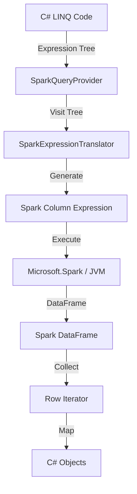

# LINQ-to-Spark

Write idiomatic C# LINQ that executes on Apache Spark clusters.

## Table of Contents

1. [Overview](#overview)
2. [Architecture](#architecture)
3. [Key Features](#key-features)
4. [Usage Guide](#usage-guide)
   - [Connecting](#connecting-with-the-context-api)
   - [Reading Data](#reading-data)
   - [Grouping and Aggregation](#grouping-and-aggregation)
   - [Joins](#joins)
5. [Advanced Features](#advanced-features)
   - [Window Functions](#window-functions-analytics)
   - [Higher-Order Functions](#higher-order-array-functions-nested-data)
   - [Cases Pattern](#cases-pattern-conditional-routing)
   - [ForEach (Row Processing)](#foreach-row-processing)
   - [Custom Methods](#custom-methods-in-expressions)
   - [Set Operations](#set-operations)
   - [Math & String](#math--string-functions)
   - [Caching & Partitioning](#caching--partitioning)
6. [Build-Time Protections](#build-time-protections)
7. [Write Operations](#write-operations)
8. [Best Practices](#best-practices)
9. [Comparison with SnowflakeQuery](#comparison-with-snowflakequery)
10. [See Also](#see-also)

---

## Overview

DataLinq translates C# LINQ expressions to Spark DataFrame operations:

- ✅ Write C# → Execute on Spark (distributed, fault-tolerant, petabyte-scale)
- ✅ Type-safe, fluent API that feels C# native
- ✅ No need to learn Spark internals

---

## Architecture

The provider follows the standard `IQueryable` pattern, translated to Spark DataFrame operations:

### The Translation Pipeline



### Key Components

1.  **Expression Tree Translator**: Parses C# LINQ expressions at runtime and converts them to Spark Column operations (`o.Amount > 100` → `col("amount") > 100`).
2.  **Column Mapper**: Bridges C# naming conventions (PascalCase) ↔ Spark conventions (snake_case) and handles nested object mapping.
3.  **DataFrame Execution**: Manages the underlying `Microsoft.Spark` DataFrame state.

---

## Key Features

| Feature | Description | Spark Equivalent |
|---------|-------------|------------------|
| **Filtering** | `Where(x => x.Id > 1)` | `.Filter(col("id") > 1)` |
| **Projections** | `Select(x => new { x.Name })` | `.Select(col("name"))` |
| **Ordering** | `OrderBy(x => x.Date)` | `.Sort(col("date"))` |
| **Grouping** | `GroupBy(x => x.Dept)` | `.GroupBy("dept")` |
| **Joins** | `Join(other, ...)` | `.Join(other, ...)` |
| **Aggregations** | `Sum`, `Count`, `Max`, `Min` | `Functions.Sum()`, `Count()`... |
| **Window Functions** | `WithWindow(spec, ...)` | `Window.PartitionBy(...)` |
| **Nested Data** | `x.Address.City` | `col("address.city")` |
| **Higher-Order** | `x.Items.Any(i => i.Val > 10)` | `expr("exists(items, i -> i.val > 10)")` |
| **Custom Methods** | `MyClass.MyMethod(x.Field)` | Auto-registered UDF |

---

## Usage Guide

### Connecting with the Context API

The unified context API (`Spark.Connect`) represents the entry point for all Spark operations.

```csharp
// Direct connection strings
using var context = Spark.Connect("local[*]", "MyApp");                    // Local (all cores)
using var context = Spark.Connect("local[4]", "MyApp");                    // Local (4 cores)
using var context = Spark.Connect("spark://spark-master:7077", "MyApp");   // Standalone cluster
using var context = Spark.Connect("yarn", "MyApp");                        // YARN cluster
using var context = Spark.Connect("k8s://https://k8s-api:443", "MyApp");   // Kubernetes

// Using SparkMaster helpers (equivalent, type-safe)
using var context = Spark.Connect(SparkMaster.Local(), "MyApp");
using var context = Spark.Connect(SparkMaster.Local(4), "MyApp");
using var context = Spark.Connect(SparkMaster.Standalone("spark-master"), "MyApp");
using var context = Spark.Connect(SparkMaster.Yarn(), "MyApp");
using var context = Spark.Connect(SparkMaster.Kubernetes("https://k8s-api:443"), "MyApp");
```

**Advanced Configuration:**

```csharp
using var context = Spark.Connect(SparkMaster.Yarn(), "MyApp", o => {
    o.Config["spark.executor.memory"] = "4g";
    o.Config["spark.executor.cores"] = "2";
    o.Config["spark.sql.shuffle.partitions"] = "200";
    o.Hive = true;  // Enable Hive support
});
```

### Reading Data

```csharp
// From tables
var orders = context.Read.Table<Order>("orders");

// From files
var logs = context.Read.Parquet<LogEntry>("/data/logs");
var csv = context.Read.Csv<Record>("/data/file.csv");
var json = context.Read.Json<Event>("/data/events.json");

// Apply LINQ operations
var highValue = orders.Where(o => o.Amount > 1000);
```

### Pushing In-Memory Data

Push local data to Spark for distributed processing. Automatically batches large data for O(1) memory:

```csharp
// Small data - fast in-memory path
var testData = new[] { new Order { Id = 1, Amount = 100 } };
var query = context.Push(testData);

// Large data - automatically batched (O(1) memory)
var millionRows = GenerateLargeDataset();
var query = context.Push(millionRows);  // Same API, auto-optimized!

// Fluent syntax
var enriched = localData.Push(context).Where(x => x.Active);

// Custom batch size
var query = context.Push(data, batchSize: 50_000);
```

> [!TIP]
> **Pull → Process → Push workflow:** Use `Pull()` to stream data locally, process with instance methods, then `Push()` back to Spark.

### Grouping and Aggregation

Use fluent syntax for distributed aggregations:

```csharp
var stats = orders
    .GroupBy(o => o.Category)
    .Select(g => new 
    {
        Category = g.Key,
        Count = g.Count(),
        TotalSales = g.Sum(o => o.Amount),
        MaxSale = g.Max(o => o.Amount)
    });
```

### Joins

Combine distributed datasets efficiently. Supports **inner**, **left**, **right**, and **outer** joins:

```csharp
var orders = context.Read.Table<Order>("orders");
var customers = context.Read.Table<Customer>("customers");

// Inner Join (default)
var results = orders.Join(
    customers,
    o => o.CustomerId,
    c => c.Id,
    (o, c) => new { o.OrderId, c.Name }
);

// Left Join - keeps all orders, nulls for missing customers
var leftJoin = orders.Join(
    customers,
    o => o.CustomerId,
    c => c.Id,
    (o, c) => new { o.OrderId, CustomerName = c != null ? c.Name : "Unknown" },
    joinType: "left"
);

// Right Join - keeps all customers
var rightJoin = orders.Join(customers, o => o.CustomerId, c => c.Id,
    (o, c) => new { OrderId = o?.OrderId, c.Name }, joinType: "right");

// Full Outer Join
var outerJoin = orders.Join(customers, o => o.CustomerId, c => c.Id,
    (o, c) => new { o.OrderId, c.Name }, joinType: "outer");
```

**Supported Join Types:**
- `Join(...)` - INNER JOIN (default)
- `Join(..., joinType: "left")` - LEFT OUTER JOIN
- `Join(..., joinType: "right")` - RIGHT OUTER JOIN
- `Join(..., joinType: "outer")` - FULL OUTER JOIN

---

## Advanced Features

### Window Functions (Analytics)

Perform advanced analytics (Ranking, Running Totals) using Spark's window functions.

**Expression-Based API** (`WithWindowTyped`) - Fully type-safe:
```csharp
employees.WithWindowTyped(
    spec => spec .PartitionBy(e => e.Department).OrderBy(e => e.HireDate),
    (e, w) => new
    {
        e.Name,
        e.Salary,
        RunningTotal = w.Sum(x => x.Salary),
        AvgSalary = w.Avg(x => x.Salary),
        Rank = w.Rank(),
        Lag = w.Lag(x => x.Salary, 1)
    })
```

### Higher-Order Array Functions (Nested Data)

Work with nested arrays using lambda expressions (Spark 3.x+):

```csharp
// Check if ANY item matches
orders.Where(o => o.Items.Any(i => i.Price > 100))
// → exists(items, i -> i.price > 100)

// Filter array elements
orders.Select(o => new { o.Id, Expensive = o.Items.Where(i => i.Price > 100) })
// → filter(items, i -> i.price > 100)

// Transform array
orders.Select(o => new { o.Id, Prices = o.Items.Select(i => i.Price * i.Qty) })
// → transform(items, i -> i.price * i.qty)
```

### Cases Pattern (Conditional Routing)

Process multiple conditions in a single pass using the `Cases` API:

```csharp
// 1. Categorize
var categorized = query.Cases(
    x => x.Amount > 1000,   // Premium
    x => x.Amount > 500     // Standard
    // Default: Basic
);

// 2. Transform per category
var results = categorized.SelectCase(
    premium => new { Id = premium.Id, Tag = "VIP" },
    standard => new { Id = standard.Id, Tag = "Regular" },
    basic => new { Id = basic.Id, Tag = "Economy" }
);

// 3. Dispatch (Write to different tables)
await results.ForEachCase(
    vip => vip.WriteTable("VIP_ORDERS"),
    reg => reg.WriteTable("REG_ORDERS"),
    eco => eco.WriteTable("ECO_ORDERS")
);
```

### ForEach (Row Processing)

Process each row and collect results back. Perfect for counting, summing, or logging.

```csharp
// Count and sum with a lambda
int count = 0;
double total = 0;
query.ForEach(order => { count++; total += order.Amount; }).Do();
Console.WriteLine($"Processed {count} orders, total: {total}");

// Or use instance methods
var processor = new OrderProcessor();
query.ForEach(processor.Process).Do();
Console.WriteLine($"Result: {processor.Count} orders");

// Or static methods
query.ForEach(Stats.Process).Do();
Console.WriteLine($"Result: {Stats.Count} orders");
```

**Rules:**

| Rule | Description |
|------|-------------|
| Call `.Do()` | ForEach is lazy - nothing happens until you call `.Do()` |
| Use simple types | Only `int`, `long`, `double`, `float`, `decimal`, `bool`, `string` are collected back |
| Collections don't work | `List<T>`, `Dictionary` etc. are NOT collected |
| String order varies | If collecting strings, the order may vary |

> [!TIP]
> **ForEach runs your code in parallel across the cluster.** Results are automatically collected and merged back.

---

### Custom Methods in Expressions

Use your own C# methods directly in `Where`, `Select`, etc. They work automatically!

```csharp
// Define your methods
public static class MyHelpers
{
    public static string Classify(double amount) => 
        amount > 1000 ? "HIGH" : amount > 500 ? "MEDIUM" : "LOW";
    
    public static bool IsHighValue(double amount) => amount > 1000;
}

// Use them - just works!
var results = orders
    .Where(o => MyHelpers.IsHighValue(o.Amount))
    .Select(o => new { o.Id, Category = MyHelpers.Classify(o.Amount) });
```

**Rules:**

| Rule | Reason |
|------|--------|
| Methods must be **static** | Instance methods only work in `ForEach`, not in `Where`/`Select` |
| Use primitive types | `int`, `long`, `double`, `float`, `string`, `bool` only |
| No `decimal` | Use `double` instead |

> [!IMPORTANT]
> **Static methods only in Where/Select!** If you need instance methods, use `ForEach` or `Pull()` to process locally.

**Automatic Deployment:**

DataLinq automatically distributes your code to all workers when you call `Spark.Connect()`. No manual setup needed - just press F5 and it works!

```csharp
// Disable auto-distribution if needed (not recommended)
var context = Spark.Connect(master, "MyApp", opts => opts.AutoDistributeAssemblies = false);
```

### Set Operations

```csharp
var combined = query1.Union(query2);       // UNION ALL
var common = query1.Intersect(query2);     // INTERSECT
var diff = query1.Except(query2);          // EXCEPT
```

### Math & String Functions

**Math:** `Abs`, `Round`, `Ceiling`, `Floor`, `Sqrt`, `Pow`
**String:** `Length`, `Contains`, `StartsWith`, `EndsWith`, `ToUpper`, `ToLower`, `Trim`, `Substring`, `IndexOf`, `Replace`

```csharp
var query = products.Select(p => new {
    CleanName = p.Name.Trim().ToUpper(),
    Score = Math.Round(p.Rating, 2)
});
```

### Caching & Partitioning

Control distributed execution:

```csharp
var cached = query.Cache();
var repartitioned = query.Repartition(8);
```

---

## Build-Time Protections

DataLinq includes a **Roslyn analyzer** that catches common mistakes at compile time, before you even run your code.

### Warnings You May See

| Code | What It Means | What To Do |
|------|--------------|------------|
| **DFSP001** | String field in ForEach - order may vary | Accept or use numeric counter |
| **DFSP002** | Collection field won't be collected | Use numeric counters instead |
| **DFSP004** | Custom method detected | Informational - performance note |
| **DFSP005** | Instance method in Where/Select | Use static method or ForEach |
| **DFSP006** | Multiple custom methods | Consider combining into one |
| **DFSP007** | Decimal property in model | ⚠️ Auto-converts to double (precision loss) |
| **DFSP008** | Float property in model | ℹ️ Auto-converts to double |

### Example

```csharp
var validator = new OrderValidator();
query.Where(o => validator.IsValid(o));  
//                ^^^^^^^^^^^^^^^^^^^
// ❌ DFSP005: Instance method not supported in Where - use static method
```

**Fix:**
```csharp
// Option 1: Make it static
query.Where(o => OrderValidator.IsValid(o));

// Option 2: Use ForEach (supports instance methods)
query.ForEach(validator.Process).Do();

// Option 3: Process locally
query.Pull().Where(o => validator.IsValid(o));
```

### Suppressing Warnings

If you understand the implications:

```csharp
#pragma warning disable DFSP001
string log = "";
query.ForEach(o => log += $"{o.Id},").Do();
#pragma warning restore DFSP001
```

### Configuring Severity

You can escalate warnings to errors (or suppress them) using `.editorconfig`:

```ini
[*.cs]
# Treat decimal precision loss as error
dotnet_diagnostic.DFSP007.severity = error

# Treat float conversion as warning (default is info)
dotnet_diagnostic.DFSP008.severity = warning

# Suppress a rule completely
dotnet_diagnostic.DFSP001.severity = none
```

## Write Operations

SparkQuery provides a fluent, awaitable Write API for various formats:

```csharp
var query = context.Read.Table<Order>("orders").Where(o => o.Amount > 1000);

// File outputs (Parquet, CSV, JSON, ORC)
await query.WriteParquet("/output/high_value");
await query.WriteCsv("/output/high_value_csv").WithHeader();
await query.WriteJson("/output/high_value_json");

// Table operations
await query.WriteTable("analytics.high_value_orders").Overwrite();
```

---

## Best Practices

### 1. String Comparisons
Use `ToUpper()` or `ToLower()` for consistent case-insensitive comparisons across distributed nodes.
```csharp
.Where(x => x.Name.ToUpper() == "JOHN")
```

### 2. Debugging & Diagnostics
Use `Show()` to peek at data without collecting everything, and `Explain()` to see the execution plan.

```csharp
query.Where(x => x.Amount > 100).Spy("Filtered").Show(20);
query.Explain();
```

### 3. Optimize for Distribution
- **Avoid Collect()**: `ToList()` transfers data to the driver. Only use it for small result sets.
- **Use Partitioning**: When writing large datasets, use `.PartitionBy(col)` to optimize downstream reads.
- **Filter Early**: Apply `.Where()` as early as possible to reduce data shuffle.

### 4. Important Limitations

> [!IMPORTANT]
> **Skip() requires OrderBy()**: The `Skip()` method throws if called without a prior `OrderBy()` because Spark internally uses window functions (`RowNumber()`) to implement pagination.

```csharp
// ❌ Throws InvalidOperationException
query.Skip(10).Take(5);

// ✅ Works
query.OrderBy(x => x.Id).Skip(10).Take(5);
```

> [!NOTE]
> **Type Auto-Conversion**: Some .NET types are not directly supported by Microsoft.Spark. DataLinq handles this automatically:
>
> | .NET Type | Spark Storage | Round-Trip |
> |-----------|--------------|------------|
> | `decimal` | `double` | ✅ Automatic (precision limited to ~15 digits) |
> | `float` | `double` | ✅ Automatic |
> | `DateTime` | `string` (ISO 8601) | ✅ Automatic |
>
> For precision-critical decimal values (>15 digits), use `double` explicitly or store as strings.

## Comparison with SnowflakeQuery

| Feature | SparkQuery | SnowflakeQuery |
|---------|------------|----------------|
| **Execution Engine** | Apache Spark (JVM) | Snowflake SQL |
| **Window Functions** | ✅ Supported | ✅ Supported |
| **Set Operations** | ✅ Supported | ✅ Supported |
| **Nested Data** | ✅ Struct (`.`) | ✅ `VARIANT` (`:`) |
| **Caching** | ✅ Manual (`.Cache()`) | ⚡ Automatic |
| **Distribution** | ✅ Manual (`.Repartition()`) | ⚡ Automatic |

Both providers share ~95% API surface area, allowing you to reuse your LINQ skills across both Big Data platforms.

---

## Known Limitations

The following features are not currently supported due to architectural constraints:

| Feature | Issue | Workaround |
|---------|-------|------------|
| **Self-Joins** | `query.Join(query, ...)` fails | Create separate queries or use SQL |
| **Composite Join Keys** | `Join(..., x => new { x.A, x.B }, ...)` fails | Join on single key, add `Where` clause for additional conditions |

> [!TIP]
> For composite keys, you can often work around by joining on one key and filtering:
> ```csharp
> // Instead of: orderQuery.Join(details, o => new { o.Id, o.Type }, d => new { d.OrderId, d.Type }, ...)
> // Use:
> orderQuery.Join(details, o => o.Id, d => d.OrderId, (o, d) => new { Order = o, Detail = d })
>           .Where(x => x.Order.Type == x.Detail.Type);
> ```

---

## See Also

- [LINQ-to-Snowflake](LINQ-to-Snowflake.md) — Snowflake integration
- [Cases Pattern](Cases-Pattern.md) — Advanced conditional routing


