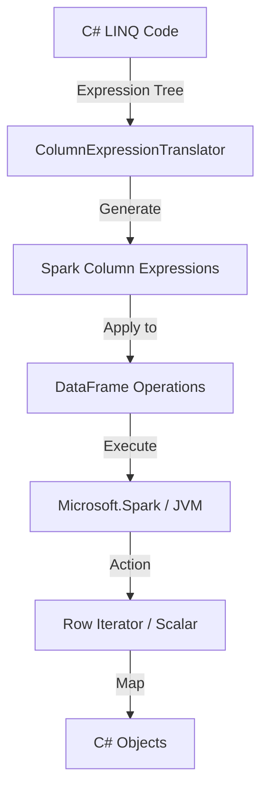

# LINQ-to-Spark

Write idiomatic C# LINQ that executes on Apache Spark clusters.

## Table of Contents

1. [Overview](#overview)
2. [Architecture](#architecture)
3. [Key Features](#key-features)
4. [Usage Guide](#usage-guide)
   - [Connecting](#connecting-with-the-context-api)
   - [Reading Data](#reading-data)
   - [Pushing In-Memory Data](#pushing-in-memory-data)
   - [Grouping and Aggregation](#grouping-and-aggregation)
   - [Joins](#joins)
5. [Advanced Features](#advanced-features)
   - [Window Functions](#window-functions-analytics)
   - [Higher-Order Functions](#higher-order-array-functions-nested-data)
   - [Cases Pattern](#cases-pattern-conditional-routing)
   - [ForEach (Row Processing)](#foreach-row-processing)
   - [Custom Methods](#custom-methods-in-expressions)
   - [Set Operations](#set-operations)
   - [Math & String](#math--string-functions)
   - [Caching & Partitioning](#caching--partitioning)
6. [Pull — Streaming Data to the Driver](#pull--streaming-data-to-the-driver)
7. [Licensing](#licensing)
8. [Build-Time Protections](#build-time-protections)
9. [Write Operations](#write-operations)
10. [Best Practices](#best-practices)
11. [Known Limitations](#known-limitations)
12. [See Also](#see-also)

---

## Overview

DataLinq translates C# LINQ expressions to Spark DataFrame operations:

- ✅ Write C# → Execute on Spark (distributed, fault-tolerant, petabyte-scale)
- ✅ Type-safe, fluent API that feels C# native
- ✅ No need to learn Spark internals

### The `dotnet/spark` Successor

If your team is stranded on old, deprecated versions of Microsoft's `dotnet/spark`, DataLinq is your lifeboat. DataLinq.Spark provides a modern, commercially maintained replacement that generates highly optimized execution plans without the overhead of bridging every single method call. Stop worrying about deprecation and skip the PySpark rewrite.

---

## Architecture

DataLinq.Spark translates C# LINQ expression trees into Spark DataFrame operations. Each LINQ operator (`.Where()`, `.Select()`, etc.) builds up a deferred expression tree that is translated and executed only when you call an action method (`.ToArray()`, `.Pull()`, `.Count()`, etc.).

### The Translation Pipeline


```mermaid
graph TD
    UserCode[C# LINQ Code] -->|Expression Tree| Translator[ColumnExpressionTranslator]
    Translator -->|Generate| Column[Spark Column Expressions]
    Column -->|Apply to| DF[DataFrame Operations]
    DF -->|Execute| Spark[Microsoft.Spark / JVM]
    Spark -->|Action| Results[Row Iterator / Scalar]
    Results -->|Map| Objects[C# Objects]
```

### Key Components

1.  **Expression Tree Translator** (`ColumnExpressionTranslator`): Walks C# expression trees and converts them to Spark Column operations (`o.Amount > 100` → `col("amount") > 100`). Supports binary, unary, method calls, ternary, member init, and auto-UDF expressions.
2.  **Column Mapper** (`ConventionColumnMapper`): Bridges C# naming conventions (PascalCase) ↔ Spark conventions (snake_case) and handles nested object mapping. Materializes Spark `Row` objects back into C# objects using compiled expression trees.
3.  **DataFrame Execution**: `SparkQuery<T>` wraps a `DataFrame` and provides typed, fluent LINQ methods that compose DataFrame operations lazily.

---

## Key Features

| Feature | Description | Spark Equivalent |
|---------|-------------|------------------|
| **Filtering** | `Where(x => x.Id > 1)` | `.Filter(col("id") > 1)` |
| **Projections** | `Select(x => new { x.Name })` | `.Select(col("name"))` |
| **Ordering** | `OrderBy(x => x.Date)` | `.Sort(col("date"))` |
| **Grouping** | `GroupBy(x => x.Dept)` | `.GroupBy("dept")` |
| **Joins** | `Join(other, ...)` | `.Join(other, ...)` |
| **Aggregations** | `Sum`, `Count`, `Max`, `Min` | `Functions.Sum()`, `Count()`... |
| **Window Functions** | `WithWindow(spec, ...)` | `Window.PartitionBy(...)` |
| **Nested Data** | `x.Address.City` | `col("address.city")` |
| **Higher-Order** | `x.Items.Any(i => i.Val > 10)` | `expr("exists(items, i -> i.val > 10)")` |
| **Custom Methods** | `MyClass.MyMethod(x.Field)` | Auto-registered UDF |

---

## Usage Guide

### Connecting with the Context API

The unified context API (`Spark.Connect`) represents the entry point for all Spark operations.

```csharp
// Direct connection strings
using var context = Spark.Connect("local[*]", "MyApp");                    // Local (all cores)
using var context = Spark.Connect("local[4]", "MyApp");                    // Local (4 cores)
using var context = Spark.Connect("spark://spark-master:7077", "MyApp");   // Standalone cluster
using var context = Spark.Connect("yarn", "MyApp");                        // YARN cluster
using var context = Spark.Connect("k8s://https://k8s-api:443", "MyApp");   // Kubernetes

// Using SparkMaster helpers (equivalent, type-safe)
using var context = Spark.Connect(SparkMaster.Local(), "MyApp");
using var context = Spark.Connect(SparkMaster.Local(4), "MyApp");
using var context = Spark.Connect(SparkMaster.Standalone("spark-master"), "MyApp");
using var context = Spark.Connect(SparkMaster.Yarn(), "MyApp");
using var context = Spark.Connect(SparkMaster.Kubernetes("https://k8s-api:443"), "MyApp");
```

**Advanced Configuration:**

```csharp
using var context = Spark.Connect(SparkMaster.Yarn(), "MyApp", o => {
    o.Config["spark.executor.memory"] = "4g";
    o.Config["spark.executor.cores"] = "2";
    o.Config["spark.sql.shuffle.partitions"] = "200";
    o.Hive = true;  // Enable Hive support
});
```

### Reading Data

```csharp
// From tables
var orders = context.Read.Table<Order>("orders");

// From files
var logs = context.Read.Parquet<LogEntry>("/data/logs");
var csv = context.Read.Csv<Record>("/data/file.csv");
var json = context.Read.Json<Event>("/data/events.json");

// Apply LINQ operations
var highValue = orders.Where(o => o.Amount > 1000);
```

### Pushing In-Memory Data

Push local data to Spark for distributed processing. Automatically batches large data for O(1) memory:

```csharp
// Small data - fast in-memory path
var testData = new[] { new Order { Id = 1, Amount = 100 } };
var query = context.Push(testData);

// Large data - automatically batched (O(1) memory)
var millionRows = GenerateLargeDataset();
var query = context.Push(millionRows);  // Same API, auto-optimized!

// Fluent syntax
var enriched = localData.Push(context).Where(x => x.Active);

// Custom batch size
var query = context.Push(data, batchSize: 50_000);
```

### Grouping and Aggregation

Use fluent syntax for distributed aggregations:

```csharp
var stats = orders
    .GroupBy(o => o.Category)
    .Select(g => new 
    {
        Category = g.Key,
        Count = g.Count(),
        TotalSales = g.Sum(o => o.Amount),
        MaxSale = g.Max(o => o.Amount)
    });
```

> [!TIP]
> **Performance Architecture (Aggregations):** Aggregate functions within `GroupBy` are executed as pure map-side reductions. To count or sum a filtered subset, apply a `Where` filter *before* grouping. DataLinq intentionally disables inline aggregate predicates (e.g., `Count(x => x.IsActive)`) to guarantee you benefit from partition-level filtering. Additionally, to calculate global statistics across an entire dataset, call aggregate methods directly on the query object rather than grouping by a constant string, which prevents unnecessary network shuffles.

### Joins

Combine distributed datasets efficiently. Supports **inner**, **left**, **right**, and **outer** joins:

```csharp
var orders = context.Read.Table<Order>("orders");
var customers = context.Read.Table<Customer>("customers");

// Inner Join (default)
var results = orders.Join(
    customers,
    o => o.CustomerId,
    c => c.Id,
    (o, c) => new { o.OrderId, c.Name }
);

// Left Join - keeps all orders, nulls for missing customers
var leftJoin = orders.Join(
    customers,
    o => o.CustomerId,
    c => c.Id,
    (o, c) => new { o.OrderId, CustomerName = c != null ? c.Name : "Unknown" },
    joinType: "left"
);

// Right Join - keeps all customers
var rightJoin = orders.Join(customers, o => o.CustomerId, c => c.Id,
    (o, c) => new { OrderId = o?.OrderId, c.Name }, joinType: "right");

// Full Outer Join
var outerJoin = orders.Join(customers, o => o.CustomerId, c => c.Id,
    (o, c) => new { o.OrderId, c.Name }, joinType: "outer");
```

**Supported Join Types:**
- `Join(...)` - INNER JOIN (default)
- `Join(..., joinType: "left")` - LEFT OUTER JOIN
- `Join(..., joinType: "right")` - RIGHT OUTER JOIN
- `Join(..., joinType: "outer")` - FULL OUTER JOIN

---

## Advanced Features

### Window Functions (Analytics)

Perform advanced analytics (Ranking, Running Totals) using Spark's window functions.

**Expression-Based API** (`WithWindow`) - Fully type-safe:
```csharp
employees.WithWindow(
    spec => spec.PartitionBy(e => e.Department).OrderBy(e => e.HireDate),
    (e, w) => new
    {
        e.Name,
        e.Salary,
        RunningTotal = w.Sum(x => x.Salary),
        AvgSalary = w.Avg(x => x.Salary),
        Rank = w.Rank(),
        Lag = w.Lag(x => x.Salary, 1)
    })
```

### Higher-Order Array Functions (Nested Data)

Work with nested arrays using lambda expressions (Spark 3.x+):

```csharp
// Check if ANY item matches
orders.Where(o => o.Items.Any(i => i.Price > 100))
// → exists(items, i -> i.price > 100)

// Filter array elements
orders.Select(o => new { o.Id, Expensive = o.Items.Where(i => i.Price > 100) })
// → filter(items, i -> i.price > 100)

// Transform array
orders.Select(o => new { o.Id, Prices = o.Items.Select(i => i.Price * i.Qty) })
// → transform(items, i -> i.price * i.qty)
```

### Cases Pattern (Conditional Routing)

Process multiple conditions in a single pass using the `Cases` API:

```csharp
// 1. Categorize
var results = query.Cases(
    x => x.Amount > 1000,   // Premium (category 0)
    x => x.Amount > 500     // Standard (category 1)
    // Default: Basic        (category 2)
)
// 2. Transform per category
.SelectCase(
    premium  => new { Id = premium.Id, Tag = "VIP" },
    standard => new { Id = standard.Id, Tag = "Regular" },
    basic    => new { Id = basic.Id, Tag = "Economy" }
)
// Or use object initializers with concrete types:
// .SelectCase(
//     premium  => new OrderTag { Id = premium.Id, Label = "VIP" },
//     standard => new OrderTag { Id = standard.Id, Label = "Regular" }
// )
// 3. Dispatch (Write to different tables — async lambdas)
await .ForEachCase(
    async vip => await vip.WriteTable("VIP_ORDERS", overwrite: true),
    async reg => await reg.WriteTable("REG_ORDERS", overwrite: true),
    async eco => await eco.WriteTable("ECO_ORDERS", overwrite: true)
)
// 4. Extract results (unwraps the tuple to flat items)
.AllCases()
.OrderBy(r => r.Id)
.ToList();
```

> [!NOTE]
> All write methods (`WriteTable`, `WriteParquet`, `WriteCsv`, etc.) return `Task`. The compiler warns (CS4014) if a Task is not awaited in an async context. Use the async `ForEachCase` overload with `async/await` to ensure writes execute.

> [!NOTE]
> **Strict Tuple Safety:** For complete pipeline traceability, `SelectCase` returns a strictly typed tuple: `(int category, T originalItem, TNew newItem)`.
> This enterprise pattern guarantees you never lose the lineage of the original row. When working with intermediate results, access projected properties via `.newItem` (e.g., `x.newItem.Id`). To finalize the pipeline, call `.AllCases()` which automatically unwraps the tuple into a highly optimized, flat `SparkQuery<TNew>`.

### ForEach (Row Processing)

Process each row and collect results back. Perfect for counting, summing, or logging. DataLinq.Spark implements the **Delta Reflection Protocol**, which automatically synchronizes your local fields with the distributed execution state after the cluster finishes processing.

```csharp
// 1. Lambda closure — captured variables sync back
int count = 0;
double total = 0;
query.ForEach(order => { count++; total += order.Amount; }).Do();
Console.WriteLine($"Processed {count} orders, total: {total}");

// 2. Instance method — instance fields sync back
var processor = new OrderProcessor();
query.ForEach(processor.Process).Do();
Console.WriteLine($"Result: {processor.Count} orders");

// 3. Static method — static fields sync back
query.ForEach(Stats.Process).Do();
Console.WriteLine($"Result: {Stats.Count} orders");
```

**Synchronization Rules:**

| Rule | Description |
|------|-------------|
| **Call `.Do()`** | `ForEach` is lazy. No distributed execution (or sync-back) occurs until you call `.Do()`. |
| **Primitives Only** | Only `int`, `long`, `double`, `float`, `decimal`, `bool`, and `string` fields are synchronized. |
| **Additive Merge Only** | The protocol merges field deltas by **addition** across partitions. Only `+=`, `++`, and `-=` patterns produce correct results. Conditional assignments like `if (x > max) max = x` will produce incorrect values because each partition's delta is summed independently. Use server-side aggregations (`Max()`, `Min()`) for these operations. |
| **Collections Fail** | `List<T>`, `Dictionary`, arrays, etc. are **NOT** synchronized back. Use numeric counters instead. |
| **String Concatenation** | If collecting strings, the final appended order is **non-deterministic** due to distributed parallelism. |

> [!TIP]
> **Why this works:** The Delta Reflection Protocol serializes your instance/static states, ships them to the executor nodes, captures the mutated deltas after the `ForEach` runs in parallel, and safely merges those primitive deltas back into your original memory context on the driver.

---

### Custom Methods in Expressions

Use your own C# methods directly in `Where`, `Select`, etc. They work automatically!

```csharp
// Define your methods
public static class MyHelpers
{
    public static string Classify(double amount) => 
        amount > 1000 ? "HIGH" : amount > 500 ? "MEDIUM" : "LOW";
    
    public static bool IsHighValue(double amount) => amount > 1000;
}

// Use them - just works!
var results = orders
    .Where(o => MyHelpers.IsHighValue(o.Amount))
    .Select(o => new { o.Id, Category = MyHelpers.Classify(o.Amount) });
```

**Rules:**

| Rule | Reason |
|------|--------|
| **Instance Methods & Closures Fully Supported** | Local variable closures (captured `Func<>` delegates) and instance methods work in `Where`/`Select`/`Cases`. DataLinq serializes the captured state via Row-based UDFs — closure variables and instance fields are transmitted to the Spark worker with their actual values. |
| Use primitive types | `int`, `long`, `double`, `float`, `string`, `bool` only |
| No `decimal` | Use `double` instead |

> [!TIP]
> **Performance Note:** Instance methods and closures carry a slight serialization overhead (Row-based UDF wrapping). DataLinq issues an informational analyzer warning (`DFSP005`) to keep you aware of this translation path. Static methods are faster — they use direct UDF registration with no serialization.

**Automatic Deployment:**

DataLinq automatically distributes your code to all workers when you call `Spark.Connect()`. No manual setup needed - just press F5 and it works!

```csharp
// Disable auto-distribution if needed (not recommended)
var context = Spark.Connect(master, "MyApp", opts => opts.AutoDistributeAssemblies = false);
```

### Set Operations

DataLinq executes set operations strictly at the partition level for extreme throughput:

```csharp
var combined = query1.Union(query2);       // UNION ALL (Zero-Shuffle)
var common = query1.Intersect(query2);     // INTERSECT
var diff = query1.Except(query2);          // EXCEPT
```

> [!NOTE]
> **Zero-Shuffle Union:** To maximize ingestion speed, `.Union()` maps directly to Spark's `union()` logical plan (equivalent to SQL `UNION ALL`). This preserves all incoming rows and bypasses the massive global shuffle required for deduplication. If your pipeline requires strict distinct rows, deliberately chain the `.DropDuplicates()` operator.

### Math & String Functions

**Math:** `Abs`, `Round`, `Ceiling`, `Floor`, `Sqrt`, `Pow`
**String:** `Length`, `Contains`, `StartsWith`, `EndsWith`, `ToUpper`, `ToLower`, `Trim`, `Substring`, `IndexOf`, `Replace`

```csharp
var query = products.Select(p => new {
    CleanName = p.Name.Trim().ToUpper(),
    Score = Math.Round(p.Rating, 2)
});
```

> [!TIP]
> **Data Engineering Primitives:** The translation engine ships with highly optimized execution paths for core data-engineering mathematics. Specialized operations (like trigonometric `Math.Cos` or `Math.Sin`) are intentionally untranslated to encourage evaluating complex row-level math via vectorized UDFs, ensuring predictable cluster stability.

### Caching & Partitioning

Control distributed execution:

```csharp
var cached = query.Cache();
var repartitioned = query.Repartition(8);
```

---

## Pull — Streaming Data to the Driver

`Pull()` streams data from Spark to the driver lazily, one row at a time. Unlike `ToArray()` / `ToList()` which collect everything into memory, `Pull()` uses `O(partition_size)` memory — suitable for large result sets.

```csharp
// Basic streaming — lazy IAsyncEnumerable<T>
await foreach (var order in query.Pull())
{
    ProcessOrder(order);
}

// With prefetch (default: true) — reads next partition while you process
await foreach (var order in query.Pull(prefetch: true))
{
    ProcessOrder(order);
}
```

### Memory-Bounded Streaming

`Pull(int bufferSize)` lets you control the maximum number of rows held in memory at any time. DataLinq auto-repartitions if needed to keep each partition within your memory budget:

```csharp
// Stream with at most 500 rows in memory at a time
await foreach (var order in query.Pull(bufferSize: 500))
{
    ProcessOrder(order);
}
```

> [!TIP]
> **Pull → Process → Push workflow:** Use `Pull()` to stream data locally, process with instance methods, then `Push()` back to Spark.

---

## Licensing

DataLinq.Spark uses a tiered licensing model:

| Tier | Row Limit | How to Activate |
|------|-----------|----------------|
| **Development** | 1,000 rows | Default — no license needed |
| **Production** | Unlimited | Set `DATALINQ_LICENSE_KEY` environment variable |

### Zero-Friction Onboarding

No license key is required to get started. When no license is detected, DataLinq automatically enables the Development tier, which provides full API access with a 1,000-row limit on action methods (`ToArray()`, `Pull()`, `Count()`, `First()`).

```csharp
// Works immediately — no license needed!
var orders = context.Read.Parquet<Order>("/data/orders")
    .Where(o => o.Amount > 100)
    .ToArray();  // Limited to 1,000 rows in Development tier
```

### Production License

To remove the row limit, set your license key as an environment variable:

```bash
export DATALINQ_LICENSE_KEY="your-license-key-here"
```

Or in `launchSettings.json`:
```json
{
  "environmentVariables": {
    "DATALINQ_LICENSE_KEY": "your-license-key-here"
  }
}
```

> [!NOTE]
> The Development tier is fully functional — same API, same features. The only difference is the 1,000-row limit on data retrieval. This serves as a natural upgrade path: prototype freely, then purchase a license when you need production data volumes.

---

## Build-Time Protections

DataLinq includes a **Roslyn analyzer** that catches common mistakes at compile time, before you even run your code.

### Warnings You May See

| Code | What It Means | What To Do |
|------|--------------|------------|
| **DFSP001** | String field in ForEach - order may vary | Accept or use numeric counter |
| **DFSP002** | Collection field won't be collected | Use numeric counters instead |
| **DFSP004** | Custom method detected | Informational - performance note |
| **DFSP005** | Instance method in Where/Select | ℹ️ Translated via IL wrapper (closure overhead) |
| **DFSP006** | Multiple custom methods | Consider combining into one |
| **DFSP007** | Decimal property in model | ⚠️ Auto-converts to double (precision loss) |
| **DFSP008** | Float property in model | ℹ️ Auto-converts to double |

### Example

```csharp
var validator = new OrderValidator();

// ℹ️ DFSP005: Instance method detected in Where/Select
// This works perfectly! DataLinq will instantiate OrderValidator on the remote Spark JVM.
query.Where(o => validator.IsValid(o));  
```

**Understanding the warning:**
DFSP005 is an informational warning. It simply reminds you that using an instance method incurs a serialization to synchronize the instance state across the distributed worker nodes.

### Suppressing Warnings

If you understand the implications:

```csharp
#pragma warning disable DFSP001
string log = "";
query.ForEach(o => log += $"{o.Id},").Do();
#pragma warning restore DFSP001
```

### Configuring Severity

You can escalate warnings to errors (or suppress them) using `.editorconfig`:

```ini
[*.cs]
# Treat decimal precision loss as error
dotnet_diagnostic.DFSP007.severity = error

# Treat float conversion as warning (default is info)
dotnet_diagnostic.DFSP008.severity = warning

# Suppress a rule completely
dotnet_diagnostic.DFSP001.severity = none
```

## Write Operations

All write methods return `Task<SparkWriteResult>` — the compiler warns (CS4014) if not awaited.

```csharp
using DataLinq.Spark;

var query = context.Read.Table<Order>("orders").Where(o => o.Amount > 1000);

// File outputs (Parquet, CSV, JSON, ORC)
await query.WriteParquet("/output/high_value");
await query.WriteCsv("/output/high_value_csv", header: true);
await query.WriteJson("/output/high_value_json");
await query.WriteOrc("/output/high_value_orc");

// Table operations (requires Hive metastore — see note below)
await query.WriteTable("analytics.high_value_orders", overwrite: true);

// With partitioning (type-safe, auto snake_case)
await query.WriteParquet("/output", overwrite: true, partitionBy: x => x.Region);
await query.WriteParquet("/output", partitionBy: x => new { x.Region, x.Year });

// Merge (upsert — requires Hive metastore for table targets)
await query.MergeTable("target_orders", o => o.OrderId);
```

> [!IMPORTANT]
> **Table operations require Hive:** `WriteTable` and `MergeTable` targeting named tables use Spark's `insertInto`, which requires a Hive metastore. In local mode without Hive, use file-based writes (`WriteParquet`, `WriteCsv`, `WriteJson`) or the `IEnumerable.WriteTable(context, ...)` extension which writes via temporary Parquet files internally.

---

## Best Practices

### 1. String Comparisons
Use `ToUpper()` or `ToLower()` for consistent case-insensitive comparisons across distributed nodes.
```csharp
.Where(x => x.Name.ToUpper() == "JOHN")
```

### 2. Debugging & Diagnostics
Use `Show()` to peek at data without collecting everything, and `Explain()` to see the execution plan.

```csharp
query.Where(x => x.Amount > 100).Spy("Filtered").Show(20);
query.Explain();
```

### 3. Optimize for Distribution
- **Use `Pull()` for large results**: `ToArray()` / `ToList()` collect everything into memory. Use `Pull()` for lazy streaming with `O(partition_size)` memory, or `Pull(bufferSize)` for bounded memory.
- **Use Partitioning**: When writing large datasets, use `.PartitionBy(col)` to optimize downstream reads.
- **Filter Early**: Apply `.Where()` as early as possible to reduce data shuffle.

### 4. Deterministic Execution & Key Selectors

DataLinq guarantees replayable, fault-tolerant execution plans. To enforce this architecture:

- **Strict Key Selectors:** To ensure optimal map-side shuffling and predicate pushdown, DataLinq enforces deterministic, direct property access for `Join` and `GroupBy` keys. Computed expressions (e.g., `x => x.Name.ToUpper()` or `x => x.Price > 10 ? "A" : "B"`) are intentionally rejected at compile-tree generation to prevent silent performance degradation. Always project computed keys in a preceding `Select` statement.
- **Generator Isolation:** Non-deterministic local generators like `Guid.NewGuid()` cannot be embedded directly into projection trees. UUID generation should be handled at the ingestion source or mapped via deterministic hashing to maintain fault-tolerance during partition retries.

### 5. Important Limitations

> [!IMPORTANT]
> **Skip() requires OrderBy()**: The `Skip()` method throws if called without a prior `OrderBy()` because Spark internally uses window functions (`RowNumber()`) to implement pagination.

```csharp
// ❌ Throws InvalidOperationException
query.Skip(10).Take(5);

// ✅ Works
query.OrderBy(x => x.Id).Skip(10).Take(5);
```

> [!NOTE]
> **Type Auto-Conversion**: Some .NET types are not directly supported by Microsoft.Spark. DataLinq handles this automatically:
>
> | .NET Type | Spark Storage | Round-Trip |
> |-----------|--------------|------------|
> | `decimal` | `double` | ✅ Automatic (precision limited to ~15 digits) |
> | `float` | `double` | ✅ Automatic |
> | `DateTime` | `string` (ISO 8601) | ✅ Automatic |
>
> For precision-critical decimal values (>15 digits), use `double` explicitly or store as strings.

---

## Known Limitations

The following features are not currently supported due to architectural constraints:

| Feature | Issue | Workaround |
|---------|-------|------------|
| **Composite Join Keys** | `Join(..., x => new { x.A, x.B }, ...)` fails | Join on single key, add `Where` clause for additional conditions |

> [!TIP]
> For composite keys, you can often work around by joining on one key and filtering:
> ```csharp
> // Instead of: orderQuery.Join(details, o => new { o.Id, o.Type }, d => new { d.OrderId, d.Type }, ...)
> // Use:
> orderQuery.Join(details, o => o.Id, d => d.OrderId, (o, d) => new { Order = o, Detail = d })
>           .Where(x => x.Order.Type == x.Detail.Type);
> ```

---

## See Also

- [LINQ-to-Snowflake](LINQ-to-Snowflake.md) — Snowflake integration
- [Cases Pattern](Cases-Pattern.md) — Advanced conditional routing


