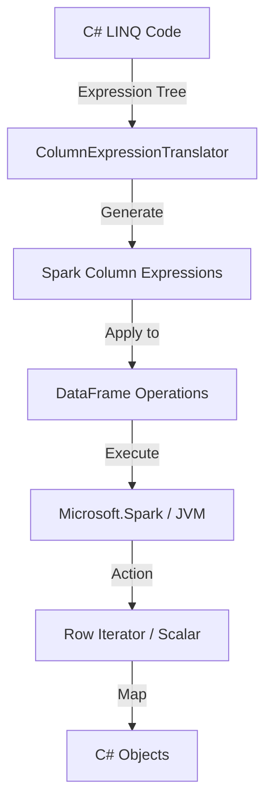

# LINQ-to-Spark

Write idiomatic C# LINQ that executes on Apache Spark clusters.

## Table of Contents

1. [Overview](#overview)
   - [Architecture](#architecture)
2. [Quick Start](#quick-start)
   - [Required Namespace](#required-namespace)
   - [Connecting](#connecting-with-the-context-api)
   - [First Query](#first-query)
   - [Compile-Time Sorting Enforcement](#compile-time-sorting-enforcement)
3. [Core Operations](#core-operations)
   - [Reading Data](#reading-data)
   - [Pushing In-Memory Data](#pushing-in-memory-data)
   - [Grouping and Aggregation](#grouping-and-aggregation)
   - [Joins](#joins)
4. [Advanced Features](#advanced-features)
   - [Window Functions](#window-functions-analytics)
   - [Higher-Order Functions](#higher-order-array-functions-nested-data)
   - [Custom Methods + Build-Time Diagnostics](#custom-methods-in-expressions)
   - [Set Operations](#set-operations)
   - [Math & String Functions](#math--string-functions)
   - [Caching & Partitioning](#caching--partitioning)
5. [Server-Side Execution](#server-side-execution)
   - [Cases Pattern](#cases-pattern-conditional-routing)
   - [ForEach (Row Processing)](#foreach-row-processing)
   - [Lazy/Terminal Reference](#lazyterminal-reference)
6. [Pull — Streaming Data to the Driver](#pull--streaming-data-to-the-driver)
7. [Write Operations](#write-operations)
8. [Best Practices](#best-practices)
9. [Licensing](#licensing)
10. [See Also](#see-also)

---

## Overview

DataLinq translates C# LINQ expressions to Spark DataFrame operations:

- ✅ Write C# → Execute on Spark (distributed, fault-tolerant, petabyte-scale)
- ✅ Type-safe, fluent API that feels C# native
- ✅ No need to learn Spark internals

### Why use this?
*   ✅ **Type Safety**: Compile-time checking of your queries using C# strong typing.
*   ✅ **No Context Switching**: Write C# instead of PySpark/Scala — same language for business logic and data processing.
*   ✅ **Unified API**: Same LINQ patterns as `SnowflakeQuery` and `IEnumerable`.
*   ✅ **Distributed Execution**: Filters, joins, and aggregations run on the Spark cluster, not your driver.

### The `dotnet/spark` Successor

If your team is stranded on old, deprecated versions of Microsoft's `dotnet/spark`, DataLinq is your lifeboat. DataLinq.Spark provides a modern, commercially maintained replacement that generates highly optimized execution plans without the overhead of bridging every single method call. Stop worrying about deprecation and skip the PySpark rewrite.

### Architecture

DataLinq.Spark translates C# LINQ expression trees into Spark DataFrame operations. Each LINQ operator (`.Where()`, `.Select()`, etc.) builds up a deferred expression tree that is translated and executed only when you call an **action** method (`.Do()`, `.ToArray()`, `.Pull()`, `.Count()`, `.Show()`, etc.).

#### The Translation Pipeline


```mermaid
graph TD
    UserCode[C# LINQ Code] -->|Expression Tree| Translator[ColumnExpressionTranslator]
    Translator -->|Generate| Column[Spark Column Expressions]
    Column -->|Apply to| DF[DataFrame Operations]
    DF -->|Execute| Spark[Microsoft.Spark / JVM]
    Spark -->|Action| Results[Row Iterator / Scalar]
    Results -->|Map| Objects[C# Objects]
```

#### Key Components

1.  **Expression Tree Translator** (`ColumnExpressionTranslator`): Walks C# expression trees and converts them to Spark Column operations (`o.Amount > 100` → `col("amount") > 100`). Supports binary, unary, method calls, ternary, member init, and auto-UDF expressions.
2.  **Column Mapper** (`ConventionColumnMapper`): Bridges C# naming conventions (PascalCase) ↔ Spark conventions (snake_case) and handles nested object mapping. Materializes Spark `Row` objects back into C# objects using compiled expression trees.
3.  **DataFrame Execution**: `SparkQuery<T>` wraps a `DataFrame` and provides typed, fluent LINQ methods that compose DataFrame operations lazily.

---

## Quick Start

### Required Namespace

```csharp
using DataLinq.Spark;
```

### Connecting with the Context API

The unified context API (`Spark.Connect`) represents the entry point for all Spark operations.

```csharp
// Direct connection strings
using var context = Spark.Connect("local[*]", "MyApp");                    // Local (all cores)
using var context = Spark.Connect("local[4]", "MyApp");                    // Local (4 cores)
using var context = Spark.Connect("spark://spark-master:7077", "MyApp");   // Standalone cluster
using var context = Spark.Connect("yarn", "MyApp");                        // YARN cluster
using var context = Spark.Connect("k8s://https://k8s-api:443", "MyApp");   // Kubernetes

// Using SparkMaster helpers (equivalent, type-safe)
using var context = Spark.Connect(SparkMaster.Local(), "MyApp");
using var context = Spark.Connect(SparkMaster.Local(4), "MyApp");
using var context = Spark.Connect(SparkMaster.Standalone("spark-master"), "MyApp");
using var context = Spark.Connect(SparkMaster.Yarn(), "MyApp");
using var context = Spark.Connect(SparkMaster.Kubernetes("https://k8s-api:443"), "MyApp");
```

**Advanced Configuration:**

```csharp
using var context = Spark.Connect(SparkMaster.Yarn(), "MyApp", o => {
    o.Config["spark.executor.memory"] = "4g";
    o.Config["spark.executor.cores"] = "2";
    o.Config["spark.sql.shuffle.partitions"] = "200";
    o.Hive = true;  // Enable Hive support
});
```

**F5 Experience (v1.3.1+):**

In local mode, `Spark.Connect()` **automatically launches the JVM debug backend** if no backend is listening on port 5567. This means you can press F5 in your IDE and everything just works — no manual `spark-submit` needed.

```csharp
// This auto-starts the JVM backend → runs your query → stops the JVM on Dispose():
using var context = Spark.Connect(SparkMaster.Local(), "MyApp");
var count = context.Read.Parquet<Order>("/data/orders").Count();
```

Requirements: `JAVA_HOME` and `SPARK_HOME` environment variables must be set. The Microsoft.Spark JAR is discovered automatically from the NuGet cache.

To disable auto-launch (e.g., when using a manually started backend):

```csharp
using var context = Spark.Connect(SparkMaster.Local(), "MyApp", o => {
    o.AutoStartBackend = false;  // Use existing JVM backend only
});
```

> Auto-launch is **ignored for remote clusters** (Standalone, YARN, Kubernetes) — those manage their own JVM infrastructure.

> [!CAUTION]
> **One SparkContext per process.** The JVM shares a single `SparkContext`. Disposing any `Spark.Connect()` context kills the shared SparkContext for ALL instances in the same process. Do not create multiple contexts in the same application — reuse a single context throughout.

### First Query

```csharp
var orders = context.Read.Table<Order>("orders");

// Filter + project + execute — all distributed until ToArray()
var results = orders
    .Where(o => o.Amount > 100)
    .Select(o => new { o.Id, o.Amount })
    .OrderBy(o => o.Amount)
    .Take(50)
    .ToArray();
```

### Compile-Time Sorting Enforcement

To guarantee deterministic pagination, ordering operations are enforced natively by the C# type system:

1. Calling `.OrderBy()` or `.OrderByDescending()` returns an `OrderedSparkQuery<T>`.
2. `.Skip()`, `.ThenBy()`, and `.ThenByDescending()` are exclusively defined on `OrderedSparkQuery<T>`.

> [!WARNING]
> **Skip() and ThenBy() require OrderBy() — enforced at compile time.**
> If you attempt to call `.Skip()` or `.ThenBy()` directly on an unordered `SparkQuery<T>`, your C# compiler will instantly fail the build. This mirrors .NET's own `IOrderedEnumerable<T>` pattern.

```csharp
// ❌ Does not compile — SparkQuery<T> has no Skip()
query.Skip(10).Take(5);

// ✅ Compiles — OrderBy() returns OrderedSparkQuery<T> which has Skip()
query.OrderBy(x => x.Id).Skip(10).Take(5);

// ✅ Multi-level sort with pagination
query.OrderBy(x => x.Date)
     .ThenByDescending(x => x.Amount)
     .Skip(20)
     .Take(10);

// ⚠️ Note: Where() after OrderBy() returns SparkQuery<T>, dropping ordered context.
// Filter BEFORE ordering, not after:
query.Where(x => x.Active)          // filter first
     .OrderBy(x => x.Id)            // then sort
     .Skip(10).Take(5);             // then paginate
```

---

## Core Operations

### Key Features

| Feature | Description | Spark Equivalent |
|---------|-------------|------------------|
| **Filtering** | `Where(x => x.Id > 1)` | `.Filter(col("id") > 1)` |
| **Projections** | `Select(x => new { x.Name })` | `.Select(col("name"))` |
| **Ordering** | `OrderBy`, `OrderByDescending`, `ThenBy` | `.Sort(...)` |
| **Pagination** | `OrderBy(...).Skip(n).Take(m)` — compile-time safe | `Window.RowNumber()` |
| **Grouping** | `GroupBy(x => x.Dept)` | `.GroupBy("dept")` |
| **Joins** | `Join(other, ...)` | `.Join(other, ...)` |
| **Aggregations** | `Sum`, `Count`, `Max`, `Min` | `Functions.Sum()`, `Count()`... |
| **Window Functions** | `WithWindow(spec, ...)` | `Window.PartitionBy(...)` |
| **Nested Data** | `x.Address.City` | `col("address.city")` |
| **Higher-Order** | `x.Items.Any(i => i.Val > 10)` | `expr("exists(items, i -> i.val > 10)")` |
| **Custom Methods** | `MyClass.MyMethod(x.Field)` | Auto-registered UDF |

### Reading Data

```csharp
// From tables
var orders = context.Read.Table<Order>("orders");

// From files
var logs = context.Read.Parquet<LogEntry>("/data/logs");
var csv = context.Read.Csv<Record>("/data/file.csv");
var json = context.Read.Json<Event>("/data/events.json");

// Apply LINQ operations
var highValue = orders.Where(o => o.Amount > 1000);
```

### Pushing In-Memory Data

Push local data to Spark for distributed processing. Use the fluent `.Push(context)` syntax:

```csharp
// Fluent syntax (recommended) — works with any IEnumerable<T>
var query = testData.Push(context).Where(x => x.Active);

// Async sources (IAsyncEnumerable<T>) — returns Task<SparkQuery<T>>
var query = await asyncStream.Push(context);

// Custom batch size for large datasets
var query = largeData.Push(context, batchSize: 50_000);
```

> **Note:** `context.Push(testData)` also exists as an equivalent context-method syntax, but the fluent extension `.Push(context)` is preferred for chaining.

### Grouping and Aggregation

Use fluent syntax for distributed aggregations:

```csharp
var stats = orders
    .GroupBy(o => o.Category)
    .Select(g => new 
    {
        Category = g.Key,
        Count = g.Count(),
        TotalSales = g.Sum(o => o.Amount),
        MaxSale = g.Max(o => o.Amount)
    });

// You can use full computed expressions, Auto-UDFs, and Math functions inside GroupBy!
var computedStats = orders
    .GroupBy(o => Math.Round(o.Amount / 1000.0)) // Math expression
    .Select(g => new { Bucket = g.Key, Count = g.Count() });

var udfStats = orders
    .GroupBy(o => MyHelpers.Categorize(o.Amount)) // Auto-UDF transpilation
    .Select(g => new { Category = g.Key, Total = g.Sum(o => o.Amount) });
```

> [!TIP]
> **Performance Architecture (Aggregations):** Aggregate functions within `GroupBy` are executed as pure map-side reductions. To count or sum a filtered subset, apply a `Where` filter *before* grouping. DataLinq intentionally disables inline aggregate predicates (e.g., `Count(x => x.IsActive)`) to guarantee you benefit from partition-level filtering. Additionally, to calculate global statistics across an entire dataset, call aggregate methods directly on the query object rather than grouping by a constant string, which prevents unnecessary network shuffles.

**Terminal Aggregates** — compute a single aggregate value directly, no `GroupBy` needed:

```csharp
// Returns scalar values directly — no GroupBy required
var total   = orders.Sum(o => o.Price);       // decimal? — SUM across all partitions
var average = orders.Average(o => o.Price);   // double?  — AVG across all partitions
var max     = orders.Max(o => o.Amount);      // TResult  — MAX (generic)
var min     = orders.Min(o => o.Amount);      // TResult  — MIN (generic)

// Composable with Where
var activeTotal = orders.Where(o => o.Year == 2024).Sum(o => o.Price);
```

> **Note:** `Sum` and `Average` accept `decimal` selectors only (matching Spark's numeric precision model). `Max` and `Min` are generic — they work with any comparable type.

### Joins

Combine distributed datasets efficiently. Supports **inner**, **left**, **right**, and **outer** joins:

```csharp
var orders = context.Read.Table<Order>("orders");
var customers = context.Read.Table<Customer>("customers");

// Inner Join (default)
var results = orders.Join(
    customers,
    o => o.CustomerId,
    c => c.Id,
    (o, c) => new { o.OrderId, c.Name }
);

// Left Join - keeps all orders, nulls for missing customers
var leftJoin = orders.Join(
    customers,
    o => o.CustomerId,
    c => c.Id,
    (o, c) => new { o.OrderId, CustomerName = c != null ? c.Name : "Unknown" },
    joinType: "left"
);

// Right Join - keeps all customers
var rightJoin = orders.Join(customers, o => o.CustomerId, c => c.Id,
    (o, c) => new { OrderId = o?.OrderId, c.Name }, joinType: "right");

// Full Outer Join
var outerJoin = orders.Join(customers, o => o.CustomerId, c => c.Id,
    (o, c) => new { o.OrderId, c.Name }, joinType: "outer");
```

**Supported Join Types:**
- `Join(...)` - INNER JOIN (default)
- `Join(..., joinType: "left")` - LEFT OUTER JOIN
- `Join(..., joinType: "right")` - RIGHT OUTER JOIN
- `Join(..., joinType: "outer")` - FULL OUTER JOIN

**Composite join keys** — join on multiple columns simultaneously:

```csharp
// Both sides must declare the same key arity and member order
orders.Join(details,
    o => new { o.OrderId, o.Type },   // 2-column key
    d => new { d.OrderId, d.Type },   // must match count
    (o, d) => new { o.OrderId, d.Quantity })
```

**Computed join keys** — join on transformed values:

```csharp
// String normalization
orders.Join(customers,
    o => o.CustomerCode.ToUpper(),
    c => c.Code.ToUpper(),
    (o, c) => new { o.OrderId, c.Name })

// Math normalization
orders.Join(products,
    o => Math.Round(o.Price),
    p => Math.Round(p.ListPrice),
    (o, p) => new { o.OrderId, p.Sku })
```

> [!NOTE]
> **Composite key arity is enforced at compile time by the C# type system.** Both key selectors must produce the same `TKey` type. If the types don't match, the compiler rejects it. A runtime `ArgumentException` guard exists as a safety net for type-erased (`object`) usage only.
>
> Any expression supported in `.Where()` is also supported as a computed join key.

---

## Advanced Features

### Window Functions (Analytics)

Perform advanced analytics (Ranking, Running Totals) using Spark's window functions.

**Expression-Based API** (`WithWindow`) - Fully type-safe:
```csharp
employees.WithWindow(
    spec => spec.PartitionBy(e => e.Department).OrderBy(e => e.HireDate),
    (e, w) => new
    {
        e.Name,
        e.Salary,
        RunningTotal = w.Sum(x => x.Salary),
        AvgSalary = w.Avg(x => x.Salary),
        Rank = w.Rank(),
        Lag = w.Lag(x => x.Salary, 1)
    })
```

### Higher-Order Array Functions (Nested Data)

Work with nested arrays using lambda expressions (Spark 3.x+):

```csharp
// Check if ANY item matches
orders.Where(o => o.Items.Any(i => i.Price > 100))
// → exists(items, i -> i.price > 100)

// Filter array elements
orders.Select(o => new { o.Id, Expensive = o.Items.Where(i => i.Price > 100) })
// → filter(items, i -> i.price > 100)

// Transform array
orders.Select(o => new { o.Id, Prices = o.Items.Select(i => i.Price * i.Qty) })
// → transform(items, i -> i.price * i.qty)
```

### Custom Methods in Expressions

Use your own C# methods directly in `Where`, `Select`, etc. They work automatically!

```csharp
// Define your methods
public static class MyHelpers
{
    public static string Classify(double amount) => 
        amount > 1000 ? "HIGH" : amount > 500 ? "MEDIUM" : "LOW";
    
    public static bool IsHighValue(double amount) => amount > 1000;
}

// Use them - just works!
var results = orders
    .Where(o => MyHelpers.IsHighValue(o.Amount))
    .Select(o => new { o.Id, Category = MyHelpers.Classify(o.Amount) });

// Mixed expressions decompose naturally
orders.Where(o => o.IsActive && MyHelpers.IsHighValue(o.Amount))
// → col("is_active") AND udf_ishighvalue(col("amount"))
// ↑ native Spark         ↑ auto-registered UDF
```

**Rules:**

| Rule | Reason |
|------|--------|
| **Instance Methods & Closures Fully Supported** | Local variable closures (captured `Func<>` delegates) and instance methods work in `Where`/`Select`/`Cases`. DataLinq serializes the captured state via Row-based UDFs — closure variables and instance fields are transmitted to the Spark worker with their actual values. |
| **Auto Field Sync in Where** | Instance methods that *modify* fields (detected via IL analysis) automatically synchronize those changes back to the driver — the same Delta Reflection Protocol used by ForEach. Zero configuration needed. |
| Use primitive types | `int`, `long`, `double`, `float`, `string`, `bool` only |
| No `decimal` | Use `double` instead |

**Automatic Deployment:**

DataLinq automatically distributes your code to all workers when you call `Spark.Connect()`. No manual setup needed - just press F5 and it works!

```csharp
// Disable auto-distribution if needed (not recommended)
var context = Spark.Connect(master, "MyApp", opts => opts.AutoDistributeAssemblies = false);
```

**Build-Time Diagnostics:**

DataLinq includes a **Roslyn analyzer** that catches common mistakes at compile time, before you even run your code.

| Code | Severity | What It Means |
|------|----------|---------------|
| **DFSP001** | ⚠️ Warning | String field in ForEach — order may vary across partitions |
| **DFSP002** | ⚠️ Warning | Collection field won't be collected — use numeric counters |
| **DFSP004** | ℹ️ Info | Custom method detected — informational performance note |
| **DFSP005** | ℹ️ Info | Instance method in Where/Select — translated via IL wrapper (closure overhead) |
| **DFSP006** | ⚠️ Warning | Multiple custom methods — consider combining into one |
| **DFSP007** | ⚠️ Warning | Decimal property in model — auto-converts to double (precision loss) |
| **DFSP008** | ℹ️ Info | Float property in model — auto-converts to double |

> [!TIP]
> **Performance Note:** Instance methods and closures carry a slight serialization overhead (Row-based UDF wrapping). DataLinq issues an informational analyzer warning (`DFSP005`) to keep you aware of this translation path. Static methods are faster — they use direct UDF registration with no serialization.

**Suppressing Warnings:**

```csharp
#pragma warning disable DFSP001
string log = "";
query.ForEach(o => log += $"{o.Id},").Do();
#pragma warning restore DFSP001
```

**Configuring Severity** via `.editorconfig`:

```ini
[*.cs]
dotnet_diagnostic.DFSP007.severity = error     # Treat decimal precision loss as error
dotnet_diagnostic.DFSP008.severity = warning   # Treat float conversion as warning
dotnet_diagnostic.DFSP001.severity = none       # Suppress a rule completely
```

### Set Operations

DataLinq executes set operations strictly at the partition level for extreme throughput:

```csharp
var combined = query1.Union(query2);       // UNION ALL (Zero-Shuffle)
var common = query1.Intersect(query2);     // INTERSECT
var diff = query1.Except(query2);          // EXCEPT
```

> [!NOTE]
> **Zero-Shuffle Union:** To maximize ingestion speed, `.Union()` maps directly to Spark's `union()` logical plan (equivalent to SQL `UNION ALL`). This preserves all incoming rows and bypasses the massive global shuffle required for deduplication. If your pipeline requires strict distinct rows, deliberately chain the `.DropDuplicates()` operator.

### Math & String Functions

**Math:** `Abs`, `Round`, `Ceiling`, `Floor`, `Sqrt`, `Pow`
**String:** `Length`, `Contains`, `StartsWith`, `EndsWith`, `ToUpper`, `ToLower`, `Trim`, `Substring`, `IndexOf`, `Replace`

```csharp
var query = products.Select(p => new {
    CleanName = p.Name.Trim().ToUpper(),
    Score = Math.Round(p.Rating, 2)
});
```

> [!TIP]
> **Data Engineering Primitives:** The translation engine ships with highly optimized execution paths for core data-engineering mathematics. Specialized operations (like trigonometric `Math.Cos` or `Math.Sin`) are intentionally untranslated to encourage evaluating complex row-level math via vectorized UDFs, ensuring predictable cluster stability.

### Caching & Partitioning

Control distributed execution:

```csharp
var cached = query.Cache();
var repartitioned = query.Repartition(8);
```

---

## Server-Side Execution

### Cases Pattern (Conditional Routing)

Process multiple conditions in a single distributed pass using the `Cases` API. All branching happens on the cluster — no data crosses the network until a terminal is called.

**The full Cases pipeline has three progressive levels of complexity:**

#### Level 1 — Categorize and Write

Route rows to different physical destinations based on conditions:

```csharp
// Note: overwrite comes first (positional), table names follow (params)
await query
    .Cases(
        x => x.Amount > 1000,   // Category 0: Premium
        x => x.Amount > 500     // Category 1: Standard
        // Default: Category 2 (everything else)
    )
    .SelectCase(
        premium  => new { Id = premium.Id, Tag = "VIP" },
        standard => new { Id = standard.Id, Tag = "Regular" },
        basic    => new { Id = basic.Id, Tag = "Economy" }
    )
    .WriteTables(overwrite: true, "VIP_ORDERS", "REG_ORDERS", "ECO_ORDERS");
    //            ^ required first  ^ then the target table names (params)
```

`WriteParquets` and `WriteCsvs` follow the same signature when writing to paths:

```csharp
await query.Cases(x => x.Amount > 1000, x => x.Amount > 500)
    .SelectCase(vip => vip, std => std, eco => eco)
    .WriteParquets(overwrite: true, "/output/vip", "/output/std", "/output/eco");

await query.Cases(x => x.Amount > 1000, x => x.Amount > 500)
    .SelectCase(vip => vip, std => std, eco => eco)
    .WriteCsvs(overwrite: true, header: true, "/output/vip", "/output/std", "/output/eco");
```

#### Level 2 — Per-Category Accumulation (`ForEachCase`)

`ForEachCase` uses the **Delta Reflection Protocol** to synchronize distributed row-level side-effects (static field accumulation) back to the driver. It is lazy — no compute runs until a terminal is called.

**Exit gate 1 — `UnCase()`: return to a flat query**

`UnCase()` discards the category metadata and returns a `SparkQuery<T>` representing the original data. Any subsequent terminal fires the accumulated delta sync-back:

```csharp
static int vipCount = 0;
static int stdCount = 0;

static void CountVip(Order o) { vipCount++; }
static void CountStd(Order o) { stdCount++; }

var count = query
    .Cases(o => o.Amount > 1000, o => o.Amount > 500)
    .ForEachCase(CountVip, CountStd)   // Lazy: registers per-category UDFs
    .UnCase()                          // Returns SparkQuery<Order> — no compute yet
    .Count();                          // ⚡ Terminal: executes + fires delta sync

Console.WriteLine($"Processed {count} rows, VIP: {vipCount}, Standard: {stdCount}");
```

**Exit gate 2 — `AllCases()`: return the projected type**

When `SelectCase` is in the pipeline, `AllCases()` returns `SparkQuery<R>` — the projected result type. Use `.Do()` as the terminal when no return value is needed:

```csharp
static long premiumRevenue = 0;
static long stdRevenue = 0;

static void AccumPremium(OrderSummary s) { premiumRevenue += (long)s.Total; }
static void AccumStd(OrderSummary s) { stdRevenue += (long)s.Total; }

query
    .Cases(o => o.Amount > 1000, o => o.Amount > 500)
    .SelectCase(
        vip => new OrderSummary { Id = vip.Id, Total = vip.Amount * 1.1 },
        std => new OrderSummary { Id = std.Id, Total = std.Amount },
        eco => new OrderSummary { Id = eco.Id, Total = eco.Amount * 0.9 }
    )
    .ForEachCase(AccumPremium, AccumStd, null)  // null = no action for category 2
    .AllCases()   // Returns SparkQuery<OrderSummary> — lazy
    .Do();        // ⚡ Terminal: execute + sync-back

Console.WriteLine($"Premium: {premiumRevenue}, Standard: {stdRevenue}");
```

**`Do()` directly on the 3-tuple** — When you don't need an exit query, call `.Do()` immediately after `ForEachCase`:

```csharp
query
    .Cases(o => o.Amount > 1000, o => o.Amount > 500)
    .SelectCase(vip => vip, std => std, eco => eco)
    .ForEachCase(CountVip, CountStd, null)
    .Do();  // ⚡ Fires deltasync without materializing data
```

#### Level 3 — Compose Accumulation with Physical Writes

`ForEachCase` and write terminals (`WriteTables`, `WriteParquets`, `WriteCsvs`) can be **composed**: ForEachCase registers the side-effect pipeline; the write terminal performs the physical write **and** triggers the delta sync-back:

```csharp
// Both: count rows per category AND write them to Parquet paths
await query
    .Cases(o => o.Amount > 1000, o => o.Amount > 500)
    .SelectCase(vip => vip, std => std, eco => eco)
    .ForEachCase(CountVip, CountStd, null)         // Register side-effects
    .WriteParquets(overwrite: true,                // ⚡ Terminal: writes + fires sync
        "/output/vip", "/output/std", "/output/eco");

// After the write: vipCount and stdCount are both populated
Console.WriteLine($"Written VIP: {vipCount}, Standard: {stdCount}");
```

> [!NOTE]
> **`ForEachCase` vs. write terminals — complementary, not exclusive:** `ForEachCase` registers C# memory side-effects (delta accumulation). Write terminals (`WriteTables`, `WriteParquets`, `WriteCsvs`, `MergeTables`) perform physical I/O. They serve different purposes and freely compose — a pipeline that contains both does both.

> [!TIP]
> **Terminal Auto-Materialization (TAM):** Both `ForEachCase` and the bulk writing pipelines natively enforce **Terminal Auto-Materialization**. They automatically call `DataFrame.Cache()` before initiating the multi-branch evaluation loop over the Spark Catalyst optimizer, and deterministically route memory teardown (`DataFrame.Unpersist()`) through a `finally` block. This eliminates the O(N) execution penalty from evaluating dynamic DAG branches on Spark.

> [!NOTE]
> **Tuple structure for intermediate access:** `SelectCase` returns a strictly typed 3-tuple: `(int Item1, T Item2, R Item3)` where `Item1` is the category index, `Item2` is the original row, and `Item3` is the projected result. Use `Item3` to access the projection (e.g., `x.Item3.Id`). To finalize the pipeline, call `.AllCases()` which unwraps to `SparkQuery<R>`, or `.UnCase()` which recovers `SparkQuery<T>`.

> For the full Cases philosophy, lazy execution contract, chaining rules, and API reference, see [Cases Pattern](Cases-Pattern.md).

### ForEach (Row Processing)

Process each row and collect results back. Perfect for counting, summing, or logging. DataLinq.Spark implements the **Delta Reflection Protocol**, which automatically synchronizes your local fields with the distributed execution state after the cluster finishes processing.

```csharp
// 1. Lambda closure — captured variables sync back
int count = 0;
double total = 0;
query.ForEach(order => { count++; total += order.Amount; }).Do();
Console.WriteLine($"Processed {count} orders, total: {total}");

// 2. Instance method — instance fields sync back
var processor = new OrderProcessor();
query.ForEach(processor.Process).Do();
Console.WriteLine($"Result: {processor.Count} orders");

// 3. Static method — static fields sync back
query.ForEach(Stats.Process).Do();
Console.WriteLine($"Result: {Stats.Count} orders");
```

### Where with Field Sync (Delta Reflection in Predicates)

When you use an **instance method** in `Where` that modifies fields, those field changes are automatically synchronized back to the driver — the same Delta Reflection Protocol as ForEach. No extra syntax needed.

```csharp
public class HighValueFilter
{
    public int EvaluationCount = 0;
    public int PassCount = 0;

    public bool IsHighValue(double amount)
    {
        EvaluationCount++;  // Tracked: IL detects stfld opcode
        if (amount > 1000) { PassCount++; return true; }
        return false;
    }
}

// Usage — fields sync back automatically:
var filter = new HighValueFilter();
var results = query.Where(o => filter.IsHighValue(o.Amount)).ToArray();
Console.WriteLine($"Evaluated {filter.EvaluationCount}, passed {filter.PassCount}");
```

**How it works:** DataLinq detects writable fields via IL analysis. When found, it registers a Composite UDF that encodes both the bool result and field deltas in one pass. After the query executes, deltas from all evaluated rows (including filtered-out) are aggregated and applied to your instance.

**Zero overhead when not needed:** If your instance method doesn't write any fields, the standard bool UDF is used — no composite UDF, no delta column, no sync overhead.

**Synchronization Rules:**

| Rule | Description |
|------|-------------|
| **Call `.Do()`** | `ForEach` is lazy. No distributed execution (or sync-back) occurs until you call `.Do()`. |
| **Where syncs on any terminal** | Where delta sync fires on any terminal (`.ToArray()`, `.Count()`, `.Do()`, etc.). |
| **Primitives Only** | Only `int`, `long`, `double`, `float`, `decimal`, and `string` fields are synchronized. For boolean-like tracking, use `int` with 0/1 convention. |
| **Additive Merge Only** | The protocol merges field deltas by **addition** across partitions. Only `+=`, `++`, and `-=` patterns produce correct results. Conditional assignments like `if (x > max) max = x` will produce incorrect values because each partition's delta is summed independently. Use server-side aggregations (`Max()`, `Min()`) for these operations. |
| **Collections Fail** | `List<T>`, `Dictionary`, arrays, etc. are **NOT** synchronized back. Use numeric counters instead. |
| **String Concatenation** | If collecting strings, the final appended order is **non-deterministic** due to distributed parallelism. |

**Error Handling:**

| Scenario | Behavior |
|----------|----------|
| **UDF returns an error** (worker-side reflection failure) | Errors are collected during delta aggregation and thrown as an `AggregateException` after sync completes. Partial deltas from successful rows **are** applied before the exception is raised. |
| **Callback throws an exception** | The exception escapes the UDF entirely. Spark retries the failed task (default: 4 attempts), which can cause significant delays. **Wrap your callback logic in try/catch** if you expect some rows to fail. |
| **Delta sync failure** (type mismatch, reflection error) | Throws `InvalidOperationException` with the root cause. |

> [!TIP]
> **Why this works:** The Delta Reflection Protocol serializes your instance/static states, ships them to the executor nodes, captures the mutated deltas after the `ForEach` runs in parallel, and safely merges those primitive deltas back into your original memory context on the driver.

> [!NOTE]
> **Performance characteristic:** Each `ForEach` and `ForEachCase` invocation registers UDFs with the Spark JVM. For datasets with many partitions, the sync-back overhead scales with partition count. ForEach is designed for **batch/ETL workloads** — for latency-sensitive aggregations, prefer server-side aggregates (`Sum()`, `Count()`, `Max()`).

### Lazy/Terminal Reference

Every `SparkQuery<T>` method is either a **lazy transformation** (returns `SparkQuery<T>`, schedules work) or a **terminal action** (triggers distributed compute, returns a value or `void`).

| Method | Kind | Description |
|--------|------|--------------| 
| `Where`, `Select`, `OrderBy`, `Join`, `GroupBy`... | 🔵 Lazy | Build the Spark execution plan — no compute yet |
| `ForEach(action)` | 🔵 Lazy | Registers UDF in execution plan — deferred |
| `ForEachCase(actions...)` | 🔵 Lazy | Per-category UDF pipeline — deferred |
| `Cases()`, `SelectCase()` | 🔵 Lazy | Categorization/projection — no compute yet |
| `AllCases()` | 🔵 Lazy | Returns `SparkQuery<R>` (projected type) — no data moved |
| `UnCase()` | 🔵 Lazy | Returns `SparkQuery<T>` (original type, category stripped) — no data moved |
| `Cache()` | 🔵 Lazy | Marks for caching — `.Do()` forces materialization |
| `Do()` | ⚡ **Terminal** | Execute plan, discard result — the natural "fire" idiom |
| `Count()` | ⚡ **Terminal** | Execute plan, return row count |
| `Sum()` / `Average()` / `Min()` / `Max()` | ⚡ **Terminal** | Execute plan, return scalar aggregate |
| `ToArray()` / `ToList()` | ⚡ **Terminal** | Execute plan, collect to driver |
| `First()` / `FirstOrDefault()` | ⚡ **Terminal** | Execute plan, return single element |
| `Single()` / `SingleOrDefault()` | ⚡ **Terminal** | Execute plan, verify exactly one result |
| `Any()` / `All()` | ⚡ **Terminal** | Execute plan, return boolean |
| `Pull()` | 🔵 Lazy | Stream as `IAsyncEnumerable<T>` — execution deferred until enumerated |
| `Show()` | ⚡ **Terminal** | Execute plan, print to console |
| `WriteParquet()` / `WriteCsv()` / `WriteTable()` | ⚡ **Terminal** | Execute plan, write to storage |
| `WriteTables()` / `WriteParquets()` / `WriteCsvs()` / `MergeTables()` | ⚡ **Terminal** | Cases terminal: write each category + fire `PostExecutionSync` |

> **`.Do()` is the correct terminal when no return value is needed.** It is equivalent to native Spark's `.count()` discarded — purpose-built for `ForEach(action).Do()` and `Cache().Do()` patterns. Using `.Count()` as a terminal when you don't need the count is misleading.

---

## Pull — Streaming Data to the Driver

`Pull()` streams data from Spark to the driver lazily, one row at a time. Unlike `ToArray()` / `ToList()` which collect everything into memory, `Pull()` uses `O(partition_size)` memory — suitable for large result sets.

```csharp
// Basic streaming — lazy IAsyncEnumerable<T>
await foreach (var order in query.Pull())
{
    ProcessOrder(order);
}

// With prefetch (default: true) — reads next partition while you process
await foreach (var order in query.Pull(prefetch: true))
{
    ProcessOrder(order);
}
```

### Memory-Bounded Streaming

`Pull(int bufferSize)` lets you control the maximum number of rows held in memory at any time. DataLinq auto-repartitions if needed to keep each partition within your memory budget:

```csharp
// Stream with at most 500 rows in memory at a time
await foreach (var order in query.Pull(bufferSize: 500))
{
    ProcessOrder(order);
}
```

> [!TIP]
> **Pull → Process → Push workflow:** Use `Pull()` to stream data locally, process with instance methods, then `Push()` back to Spark.

---

## Write Operations

All write methods return `Task<SparkWriteResult>` — the compiler warns (CS4014) if not awaited.

```csharp
using DataLinq.Spark;

var query = context.Read.Table<Order>("orders").Where(o => o.Amount > 1000);

// File outputs (Parquet, CSV, JSON, ORC)
await query.WriteParquet("/output/high_value");
await query.WriteCsv("/output/high_value_csv", header: true);
await query.WriteJson("/output/high_value_json");
await query.WriteOrc("/output/high_value_orc");

// Table operations (requires Hive metastore — see note below)
await query.WriteTable("analytics.high_value_orders", overwrite: true);

// With partitioning (type-safe, auto snake_case)
await query.WriteParquet("/output", overwrite: true, partitionBy: x => x.Region);
await query.WriteParquet("/output", partitionBy: x => new { x.Region, x.Year });
```

### Write Options

| Parameter | Description | Available On |
|-----------|-------------|--------------|
| `overwrite: true` | Overwrite existing data at target | All write methods |
| `header: true` | Include header row | `WriteCsv` / `WriteCsvs` |
| `partitionBy: x => x.Col` | Partition output by column (type-safe) | File writes |

### Merge (Upsert)

```csharp
// Upsert by key — matches on OrderId, updates other columns
await query.MergeTable("target_orders", o => o.OrderId);
```

### Bulk Routing (Cases Pattern)

When using the Cases pattern, dedicated multi-target write terminals route each category to a separate destination:

| Method | Description |
|--------|-------------|
| `WriteTables(overwrite, tables...)` | Write each category to a different Hive table |
| `WriteParquets(overwrite, paths...)` | Write each category to a different Parquet path |
| `WriteCsvs(overwrite, header, paths...)` | Write each category to a different CSV path |
| `MergeTables(configs...)` | Upsert each category into a different table by key |

> See [Cases Pattern — Level 1](#level-1--categorize-and-write) for full examples.

> [!NOTE]
> **Table operations use Spark's catalog.** `WriteTable` and `MergeTable` use Spark's `saveAsTable`/`insertInto` which require an active catalog. In local mode, Spark provides a **built-in Derby metastore** automatically — no external Hive setup needed. In cluster mode, a Hive metastore is typically configured by your cluster administrator. To explicitly enable Hive support, pass `o.Hive = true` in the connect options.

---

## Best Practices

### 1. String Comparisons
Use `ToUpper()` or `ToLower()` for consistent case-insensitive comparisons across distributed nodes.
```csharp
.Where(x => x.Name.ToUpper() == "JOHN")
```

### 2. Column Naming — Write C#, Forget Spark Naming

DataLinq automatically maps C# PascalCase property names to Spark snake_case column names via `ConventionColumnMapper`. Just write idiomatic C# — the translation is transparent:

```csharp
public class Order
{
    public int OrderId { get; set; }        // → column "order_id"
    public string CustomerName { get; set; } // → column "customer_name"
}

orders.Where(o => o.CustomerName == "Alice")  // → Filter(col("customer_name") == "Alice")
```

### 3. Debugging & Diagnostics

When a query returns unexpected results, use this progression:

```csharp
// Step 1: Inspect intermediate pipeline stages
query.Where(...).Spy("after-filter").OrderBy(...).Spy("after-sort");

// Step 2: View Spark's execution plan
query.Explain();

// Step 3: Peek at data without collecting everything
query.Show(20);
```

### 4. Optimize for Distribution
- **Use `Pull()` for large results**: `ToArray()` / `ToList()` collect everything into memory. Use `Pull()` for lazy streaming with `O(partition_size)` memory, or `Pull(bufferSize)` for bounded memory.
- **Use Partitioning**: When writing large datasets, use `.PartitionBy(col)` to optimize downstream reads.
- **Filter Early**: Apply `.Where()` as early as possible to reduce data shuffle.

### 5. ForEach is for ETL, not OLTP
Each `ForEach` and `ForEachCase` invocation registers UDFs and triggers distributed execution. The sync-back overhead scales with partition count. Use ForEach for batch processing pipelines — for latency-sensitive aggregations, prefer server-side aggregates (`Sum()`, `Count()`, `Max()`).

### 6. Deterministic Execution & Key Selectors

DataLinq guarantees replayable, fault-tolerant execution plans. To enforce this architecture:

- **Deterministic Join Keys:** DataLinq supports both direct property access and computed expressions in `Join` keys (e.g., `x => x.Name.ToUpper()`, `x => Math.Round(x.Price)`). Composite keys via anonymous types are also supported. However, **nested property paths** (e.g., `o => o.Address.City`) must be flattened via a preceding `Select` — see §8 below. **GroupBy** keys additionally support Auto-UDF transpilation.
- **Generator Isolation:** Non-deterministic local generators like `Guid.NewGuid()` cannot be embedded directly into projection trees. UUID generation should be handled at the ingestion source or mapped via deterministic hashing to maintain fault-tolerance during partition retries.

### 7. Type Auto-Conversion

Some .NET types are not directly supported by Microsoft.Spark. DataLinq handles this automatically:

| .NET Type | Spark Storage | Round-Trip |
|-----------|--------------|------------|
| `decimal` | `double` | ✅ Automatic* (data round-trips only) |
| `float` | `double` | ✅ Automatic |
| `DateTime` | `string` (ISO 8601) | ✅ Automatic |

> [!WARNING]
> Auto-conversion for `decimal` only applies to data storage/materialization. You **cannot** use `decimal` literals or properties within LINQ expression trees (e.g., `Where(x => x.Price > 100m)`) due to C# compiler constraints (CS0266). Use `double` for properties you intend to filter or project.
>
> For precision-critical decimal values (>15 digits), use `double` explicitly or store as strings.

### 8. Nested Property Join Keys

Nested properties in join key selectors (e.g., `o => o.Address.City`) are not currently supported. Flatten nested properties with `Select` before joining:

```csharp
// Instead of: orders.Join(customers, o => o.Address.City, c => c.City, ...)
// Use:
orders.Select(o => new { o.Id, City = o.Address.City })
      .Join(customers, o => o.City, c => c.City, ...)
```

---

## Licensing

DataLinq.Spark uses a tiered licensing model:

| Tier | Row Limit | How to Activate |
|------|-----------|----------------|
| **Development** | 1,000 rows | Default — no license needed |
| **Production** | Unlimited | Set `DATALINQ_LICENSE_KEY` environment variable |

### Zero-Friction Onboarding

No license key is required to get started. When no license is detected, DataLinq automatically enables the Development tier, which provides full API access with a 1,000-row limit on action methods (`ToArray()`, `Pull()`, `Count()`, `First()`). **Exceeding the limit throws a `LicenseException`** — results are not silently truncated.

```csharp
// Works immediately — no license needed!
var orders = context.Read.Parquet<Order>("/data/orders")
    .Where(o => o.Amount > 100)
    .ToArray();  // Throws LicenseException if result exceeds 1,000 rows
```

### Production License

To remove the row limit, set your license key as an environment variable:

```bash
export DATALINQ_LICENSE_KEY="your-license-key-here"
```

Or in `launchSettings.json`:
```json
{
  "environmentVariables": {
    "DATALINQ_LICENSE_KEY": "your-license-key-here"
  }
}
```

> [!NOTE]
> The Development tier is fully functional — same API, same features. The only difference is the 1,000-row limit on data retrieval. This serves as a natural upgrade path: prototype freely, then purchase a license when you need production data volumes.

---

## See Also

- [LINQ-to-Snowflake](LINQ-to-Snowflake.md) — Snowflake integration
- [Cases Pattern](Cases-Pattern.md) — Advanced conditional routing
