# Automatic Assembly Distribution

DataLinq.NET automatically distributes your application assemblies to Spark workers, enabling **seamless UDF execution** without manual deployment steps.

## Overview

When you call `Spark.Connect()`, DataLinq:
1. Discovers all application DLLs in your project directory
2. Distributes them to Spark workers via `SparkContext.AddFile()`
3. Enables `spark.files.overwrite=true` to ensure updates are applied

**Result:** Your UDFs "just work" - no `--archives`, no manual packaging.

## Quick Start

```csharp
// Just connect and use UDFs - assemblies distributed automatically!
using var context = Spark.Connect(SparkMaster.Standalone("spark-master"), "MyApp");

var orders = context.Read.Csv<Order>("/data/orders.csv")
    .Where(o => MyHelpers.IsHighValue(o.Amount))  // UDF just works!
    .ToList();
```

## How It Works

```mermaid
sequenceDiagram
    participant App as Your App
    participant DF as DataLinq
    participant Spark as Spark Cluster
    participant Worker as Workers

    App->>DF: Spark.Connect()
    DF->>DF: Discover app DLLs
    DF->>Spark: SparkContext.AddFile(*.dll)
    Spark->>Worker: Distribute assemblies
    
    App->>DF: query.Where(o => MyUdf(o.X))
    Worker->>Worker: Execute UDF ✓
```



## Configuration

### Default Behavior (Recommended)

Auto-distribution is **enabled by default**. No configuration needed.

### Disable Auto-Distribution

```csharp
var context = Spark.Connect(master, "MyApp", opts => 
{
    opts.AutoDistributeAssemblies = false;
});
```

> [!WARNING]
> If disabled, you must manually distribute assemblies using `spark-submit --archives`.

## Requirements

| Requirement | Details |
|-------------|---------|
| **Microsoft.Spark.Worker** | Must be installed on all workers ([download](https://github.com/dotnet/spark/releases)) |
| **DOTNET_WORKER_DIR** | Environment variable pointing to worker directory |

## What Gets Distributed

| Included | Excluded |
|----------|----------|
| Your application DLLs | System.* assemblies |
| Your dependencies | Microsoft.Extensions.* |
| DataLinq DLLs | Microsoft.Spark.* (already on workers) |

## Technical Details

### Spark Configuration

DataLinq automatically sets:
```
spark.files.overwrite = true
```

This ensures updated DLLs replace old versions when you rebuild your application.

### Assembly Discovery

The `AssemblyDistributor` class:
1. Gets the entry assembly location
2. Scans the directory for `*.dll` files
3. Filters out system and runtime assemblies
4. Calls `SparkContext.AddFile()` for each

### Performance

- Files are only transferred once per SparkContext session
- Unchanged files are skipped (via Spark's built-in content comparison)
- Distribution happens on `Connect()` before any queries run

## Troubleshooting

### UDF Not Found

If your UDF method isn't executing:
1. Ensure the method is `static`
2. Check `DOTNET_WORKER_DIR` is set on workers
3. Verify Microsoft.Spark.Worker is installed

### Large Assemblies

For assemblies > 10MB, consider:
- Breaking into smaller packages
- Using `spark.files.fetchTimeout` configuration

## See Also

- [LINQ to Spark](LINQ-to-Spark.md) - Full Spark integration guide
- [UDF Support](LINQ-to-Spark.md#user-defined-functions-udfs) - Auto-UDF registration
